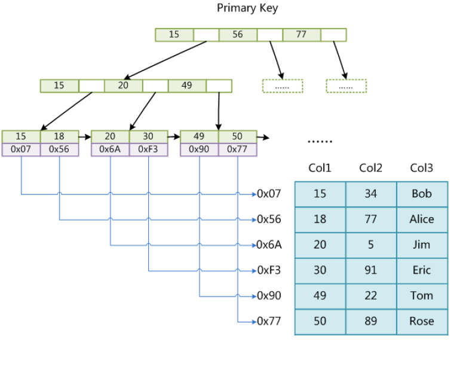

# 索引

## B+索引

## 唯一索引

## 非唯一索引

## 主键索引

唯一索引的特定类型，一个表只能建立一个主键索引。

## 聚集索引（聚簇索引）

表中记录的物理顺序与键值的索引顺序相同，一个表只能建立一个索引。

### 扩展：聚集索引和非聚集索引的区别？分别在什么情况下使用？

聚集索引和非聚集索引的根本区别是表中记录的物理顺序和索引的排列顺序是否一致。

**聚集索引**的表中记录的物理顺序与所有的排列顺序一致。  
优点是：查询速度快，因为一旦具有第一个索引值的记录被找到，具有连续索引值的记录也一定在物理上紧随其后。  
缺点是：对表进行修改的速度较慢，这是为了保持表中的记录的物理顺序和索引的顺序一致，而把记录插入到数据页的相应位置，必须在数据页进行数据重排，降低了执行速度，在插入新纪录时，数据文件为了维持B+树的特性而频繁地分裂调整，十分低效。
建议使用聚集索引的场合：某列包含小数目的不同值；排序和范围查找。

**非聚集索引**的记录的物理位置和索引的顺序不一致，又叫辅助索引。

其他区别：

* 聚集索引和非聚集索引都采用了B+树结构，但非聚集索引的叶子层并不与实际的数据页相重叠，而采用叶子层包含一个指向表中的记录在数据页中的指针的方式。聚集索引的叶子节点就是数据节点，而非聚集索引的叶子节点仍然是索引节点。
* 非聚集索引添加记录时，不会引起数据顺序的重组。看上去聚集索引的效率明显低于非聚集索引，因为每次使用辅助索引检索都要经过两次B+树查找。聚集索引的优势在哪？
  * 由于行数据和叶子节点存储在一起，这样主键和行数据是一起被载入内存的，找到叶子节点就可以立刻将行数据返回了，如果按照主键Id来组织数据，获得数据更快。
  * 辅助索引使用主键作为“指针”，而不是使用地址值作为指针的好处是：减少了当出现行移动或者数据页分裂时，辅助索引的维护工作。InnoDB在移动行时无须更新辅助索引中的这个“指针”。也就是说行的位置会随着数据库里数据的修改而发生变化，使用聚集索引就可以保证不管这个主键B+树的节点如何变化，辅助索引树都不受影响。

使用非聚集索引的场合：此列包含了大数目的不同值；频繁更新的列。

## 索引实现机制

### MyISAM索引实现

MyISAM引擎使用B+树作为索引结构，叶子节点的data域存放的是数据记录的地址。下图是MyISAM索引的原理图：

图中以Col1为主键，MyISAM的索引文件仅仅保存数据记录的地址。在MyISAM中，主索引和辅助索引在结构上没有任何区别，只是主索引要求key是唯一的，而辅助索引的key可以重复，如果在Col2上建一个辅助索引，则此索引的结构如下图所示：

同样也是一棵B+树，data域保存数据记录的地址。因此，MyISAM中所有检索的算法为首先按照B+树搜索算法搜索索引，如果指定的key存在，则取出data域的值，然后以该值为地址，读取相应的数据记录。  
MyISAM的索引方式也叫做“非聚集索引”。

### InnoDB索引实现

InnoDB的数据文件本身就是索引文件。MyISAM的索引文件和数据文件是分离的，索引文件仅保存数据记录的地址。而在InnoDB中，表数据文件本身就是按照B+树组织的一个索引结构，这棵树的叶节点data域保存了完整的数据记录。这个索引的key是数据表的主键，因此InnoDB的表数据文件本身就是主索引。

可以看到叶节点包含了完整的数据记录。这种索引叫做聚集索引。因为InnoDB的数据文件本身就按照主键聚集，所以InnoDB要求表必须要有主键（MyISAM可以没有），如果没有显示指定，MySql会自动选择一个可以唯一标识数据记录的列作为主键（一个不为null的唯一索引），如果不存在这种列，则Mysql自动为InnoDB表生成一个隐含字段作为主键，这个字段长度是6个字节，类型为长整数。  
第二个与MyISAM索引不同的是：InnoDB的辅助索引data域存储相应记录的主键值，而不是记录的地址。例如下图为定义在Col3上的一个辅助索引：

聚集索引这种实现方式使得按主键的搜索十分高效，但是辅助索引搜索需要检索两遍索引：首先检索辅助索引获取主键，然后用主键到主索引中检索获得记录。

InnoDB为什么不建议用过长的字段作为主键？
因为所有辅助索引都引用主索引，过长的主索引会令辅助索引变得过大。

InnoDB为什么不建议用非单调字段作为主键？
因为InnoDB数据文件本身是一棵B+树，非单调主键会造成在插入新记录时数据文件为了维持B+树的特性而频繁分裂调整，十分低效，推荐使用自增字段作为主键。

## 索引建立原则

### 最左匹配原则

Mysql会一直从左到右匹配索引，直到遇到范围查询（`>`，`<`，`BETWEEN`，`LIKE`）就停止匹配，范围查询会导致组合索引半生效。比如`a = 1 AND b = 2 AND c > 3 AND d = 4`，如果建立`(a,b,c,d)`顺序的索引，c可以用到索引，d就用不到；如果建立`(a,b,d,c)`的所有，则都可以用到索引，`a,b,d`的顺序可以任意调整。`WHERE`中的范围查询要放在最后（这不绝对，但可以利用一部分索引）。  
特别注意：`AND`之间的部分可以乱序，比如`a = 1 AND b = 2 AND c = 3`建立`(a,b,c)`索引可以任意顺序，Mysql的查询优化器会把索引优化成可识别的形式。但是`WHERE`语句有`OR`还说会全表遍历。

### 尽量选择区分度高的字段作为索引

### 不在索引列做运算或使用函数

### 尽量扩展索引，不要新建索引

比如表中已经有a索引，现在要添加(a,b)索引，那么只需要修改原来的索引即可。

### `WHERE`子句中经常使用的字段应该创建索引，分组字段或者排序字段应该创建索引，两个表的连接字段应该创建索引

### `LIKE`模糊查询中，右模糊查询（`321%`）会使用索引，而`%321`和`%321%`会导致全表扫描

## 常见的索引失效场景和规避方法

### WHERE语句中包含OR时，可能会导致索引失效

```sql
SELECt * FROM `user` WHERE user_id = 1 OR user_id = 2; // 旧版本索引失效

SELECt * FROM `user` WHERE user_id = 1 OR age = 20; // 索引失效，不管age有没有建立索引
```

建议：尽量避免使用`OR`，根据情况使用`UNION ALL`或者`IN`代替，这两个语句的执行效率也更好。

### WHERE语句使用负向查询，可能会导致索引失效

负向查询包括：`NOT`，`!=`，`<>`，`!<`，`!>`，`NOT IN`，`NOT LIKE`等。

### 索引列上使用内置函数，导致索引失效

```sql
SELECT * FROM `user` WHERE DATE_ADD(login_time, INTERVAL 1 DAY) = 7; // login_time索引失效
```

### 隐式类型转换，导致索引失效

```sql
SELECT * FROM `user` where user_id = 12; # user_id为varchar类型，Mysql作了隐式转换，实际执行的语句是：
SELECT * FROM `user` where CAST(user_id AS signed int) = 12; # 所以索引失效
```

### 隐式字符编码转换，导致索引失效

### 对索引列进行运算，导致索引失效

```sql
SELECT * FROM `user` where age - 1 = 10; // 索引失效
SELECT * FROM `user` where age = 10 - 1; // 规避方法：把计算放在值上，或者放应用程序中
```

### LIKE通配符可能会导致索引失效

LIKE查询以%开头的，会导致索引失效，解决办法有：

1. 将%移到后面 *(jasmine: are you kidding me?)*
2. 利用覆盖索引来命中索引：

```sql
SELECT * FROM `user` WHERE name LIKE '李%';
SELECT name FROM `user` WHERE name LIKE '%李';
```

### 联合索引中，where中索引列违背最左匹配原则
