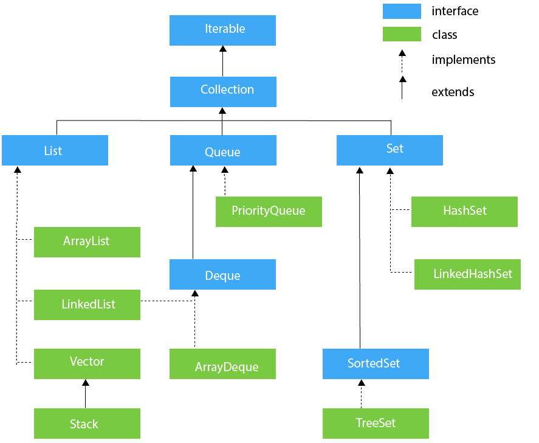

# 集合

在Java中除了以`Map`结尾的类之外，其他类都实现了`Collection`接口。并且，以`Map`结尾的类都实现了`Map`接口。



## List

有序的、可重复的

### ArrayList

* 底层使用数组实现
* 随机访问速度快，增删慢，getter()和setter()方法快
* 线程不安全
* 当容量不够时，ArrayList是当前容量的1.5倍

### Vector

* 底层使用数组实现
* 速度快，增删慢
* 线程安全、效率低
* 当容量不够时，默认扩容一倍

### LinkedList

* 底层使用双向链表
* 查询速度慢，增删快，add()和remove()方法快
* 线程不安全

## Set

无序的（存入和取出的顺序不一定相同）、不可重复。

### HashSet

* 基于HashMap实现的，底层采用HashMap来保存元素
* 存取速度快

哈希表边存放的是哈希值。HashSet 存储元素的顺序并不是按照存入时的顺序（和List 显然不同） 而是按照哈希值来存的所以取数据也是按照哈希值取得。元素的哈希值是通过元素的hashcode 方法来获取的, HashSet 首先判断两个元素的哈希值，如果哈希值一样，接着会比较equals 方法 如果 equls 结果为true ，HashSet 就视为同一个元素。如果equals 为false 就不是同一个元素。

### LinkedHashSet

* 是 HashSet 的子类，其内部是通过LinkedHashMap来实现的。

### TreeSet

* 底层使用红黑树(自平衡的排序二叉树)实现
* 排序存储
* 内部时TreeMap的SortedSet

TreeSet()是使用二叉树的原理对新add()的对象按照指定的顺序排序（升序、降序），每增加一个对象都会进行排序，将对象插入的二叉树指定的位置。Integer 和String 对象都可以进行默认的TreeSet 排序，而自定义类的对象是不可以的，自己定义的类必须实现Comparable 接口，并且覆写相应的compareTo()函数，才可以正常使用。

### Queue

## Map

使用键值对（key-value）存储，key是无序的、不可重复的，value是无序的、可重复的，每个key最多映射到一个值。

### HashMap

* JDK1.8 之前 HashMap 由数组+链表组成的，数组是 HashMap 的主体，链表则是主要为了解决哈希冲突而存在的（“拉链法”解决冲突）。JDK1.8 以后在解决哈希冲突时有了较大的变化，当链表长度大于阈值（默认为 8）（将链表转换成红黑树前会判断，如果当前数组的长度小于 64，那么会选择先进行数组扩容，而不是转换为红黑树）时，将链表转化为红黑树，以减少搜索时间。
* 线程不安全
* 允许key值为null，value值为null

### Hashtable

* 数组+链表组成的，数组是Hashtable的主体，链表则是主要为了解决哈希冲突而存在的
* 线程安全
* key和value都不允许为null

### TreeMap

* 红黑树（自平衡的排序二叉树）

### ArrayList扩容机制

默认初始容量(`DEFAULT_CAPACITY`)是10，最大容量（`MAX_ARRAY_LENGTH`）在工具类中`ArraysSupport`定义，是：`Integer.MAX_VALUE - 8`。  
当执行`add`或者`addAll`操作时，如果当前数组长度（`length`）不够，执行`grow`方法。  
`grow`方法调用工具类`ArraysSupport`的静态方法`newLength(int oldLength, int minGrowth, int prefGrowth)`计算新长度，其中`oldLength`是数组当前长度（`length`），`minGrowth`是当前大小（`size`）+要添加的元素个数，`prefGrowth`是0.5倍的当前数组长度（`length`）。  
`newLength`计算新数组长度方法为：

1. 新数组长度为`minGrowth`和`prefGrowth`中取大值，再加上旧的长度
2. 如果新数组长度不超过最大限制，则返回；否则进入`hugeLength`方法
3. `hugeLength`计算新长度为：`minGrowth`+旧的数组长度，如果算出来的值`<0`，数据溢出，抛异常；如果算出来的值小于最大限制，则采用；否则新数组长度为`Integer.MAX_VALUE`。

`newLength()`和`hugeLength()`方法源码如下：

```java
public static int newLength(int oldLength, int minGrowth, int prefGrowth) {

        //新数组长度为minGrowth和prefGrowth中取大值，再加上旧的长度
        int newLength = Math.max(minGrowth, prefGrowth) + oldLength; 
        if (newLength - MAX_ARRAY_LENGTH <= 0) {
            return newLength;
        }
        //如果新数组长度超出最大限度
        return hugeLength(oldLength, minGrowth);
    }

    private static int hugeLength(int oldLength, int minGrowth) {
        int minLength = oldLength + minGrowth;
        if (minLength < 0) { // overflow
            throw new OutOfMemoryError("Required array length too large");
        }
        if (minLength <= MAX_ARRAY_LENGTH) {
            return MAX_ARRAY_LENGTH;
        }
        return Integer.MAX_VALUE;
    }
```

### HashSet如何检查重复

当你把对象加入`HashSet`时，`HashSet`会先计算对象的`hashcode`值来判断对象加入的位置，同时也会与其他加入的对象的 `hashcode`值作比较，如果没有相符的`hashcode`，`HashSet`会假设对象没有重复出现。但是如果发现有相同`hashcode`值的对象，这时会调用`equals()`方法来检查`hashcode`相等的对象是否真的相同。如果两者相同，`HashSet`就不会让加入操作成功。

### HashMap的底层实现


