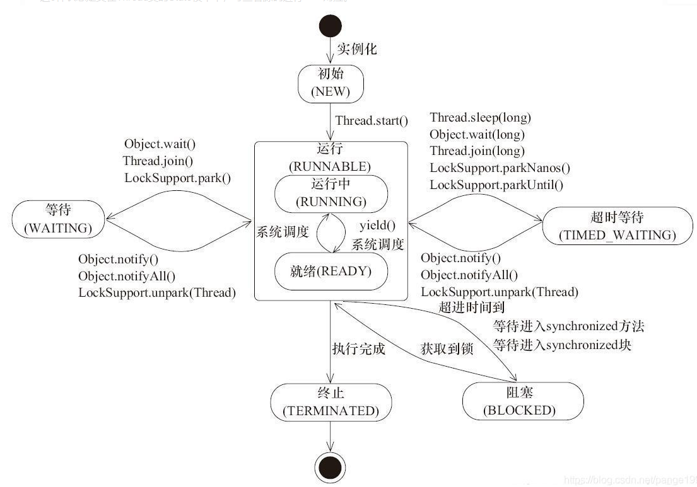

# JAVA多线程并发

## 1. JAVA线程实现/创建方式

### 1.1 继承Thread类

### 1.2 实现Runnable接口

### 1.3 通过Callable和FutureTask创建线程

1. 创建Callable接口的实现类，实现call()方法；
2. 创建Callable实现类的实例，使用FutureTask类来包装Callable对象，该FutureTask对象封装了该Callback对象的call()方法的返回值；
3. 使用FutureTask对象作为Thread对象的target创建并启动新线程；
4. 调用FutureTask对象的get()方法来获得子线程执行结束后的返回值。

```java
public class CallableThreadTest implements Callable<Integer> {
    @Override
    public Integer call() throws Exception {

        int i = 0;
        for (i = 0; i < 100; i++) {
            System.out.println(Thread.currentThread().getName() + " " + i);
        }
        return i;
    }

    public static void main(String[] args) throws ExecutionException, InterruptedException {
        CallableThreadTest callableThreadTest = new CallableThreadTest();
        FutureTask<Integer> futureTask = new FutureTask<>(callableThreadTest);
        Thread myThread = new Thread(futureTask);
        myThread.start();
        System.out.println("The future task returns: " + futureTask.get());

    }
}
```

### 1.4 基于线程池

线程和数据库连接这些资源都是非常宝贵的资源。那么每次需要的时候创建，不需要的时候销毁，是非常浪费资源的。那么我们就可以使用缓存的策略，也就是使用线程池。

```java
ExecutorService threadPool = Executors.newFixedThreadPool(10);
while (true) {
    threadPool.execute(new Runnable() { // 提交多个线程任务，并执行
        @Override
        public void run() {
            System.out.println(Thread.currentThread().getName() + " is running ..");
            try {
                Thread.sleep(3000);
            } catch (InterruptedException e) {
                e.printStackTrace();
            }
        }
    });
}
```

## 2 4种线程池

`Executors` 提供了一系列工厂方法用于创先线程池，返回的线程池都实现了`ExecutorService` 接口。  
主要有四种：

* `newCachedThreadPool`
* `newFixedThreadPool`
* `newSingleThreadExecutor`
* `newScheduledThreadPool`

### 2.1 `newCachedThreadPool`

创建一个可根据需要创建新线程的线程池，但是在以前构造的线程可用时将重用它们。对于执行很多短期异步任务的程序而言，这些线程池通常可提高程序性能。调用 execute 将重用以前构造的线程（如果线程可用）。如果现有线程没有可用的，则创建一个新线程并添加到池中。终止并从缓存中移除那些已有 60 秒钟未被使用的线程。因此，长时间保持空闲的线程池不会使用任何资源。

### 2.2 `newFixedThreadPool`

创建一个可重用固定线程数的线程池，以共享的无界队列方式来运行这些线程。在任意点，在大多数 nThreads 线程会处于处理任务的活动状态。如果在所有线程处于活动状态时提交附加任务，则在有可用线程之前，附加任务将在队列中等待。如果在关闭前的执行期间由于失败而导致任何线程终止，那么一个新线程将代替它执行后续的任务（如果需要）。在某个线程被显式地关闭之前，池中的线程将一直存在。

### 2.3 `newScheduledThreadPool`

创建一个线程池，它可安排在给定延迟后运行命令或者定期地执行。

```java
ScheduledExecutorService scheduledThreadPool = Executors.newScheduledThreadPool(3);
scheduledThreadPool.schedule(new Runnable() {
    @Override
    public void run() {
        System.out.println("延迟三秒");
        }
}, 3, TimeUnit.SECONDS);

scheduledThreadPool.scheduleAtFixedRate(new Runnable() {
    @Override
    public void run() {
        System.out.println("延迟1 秒后每三秒执行一次");
    }
}, 1, 3, TimeUnit.SECONDS);
```

### 2.4 `newSingleThreadExecutor`

Executors.newSingleThreadExecutor()返回一个线程池（这个线程池只有一个线程）,这个线程池可以在线程死后（或发生异常时）重新启动一个线程来替代原来的线程继续执行下去！

## 3 线程生命周期

JAVA线程实际有6个状态，在枚举类`Thread.State`定义：`NEW`, `RUNNABLE`, `BLOCKED`, `WAITING`, `TIMED_WAITING`, `TERMINATED`.
| 状态名称 | 说明 |
| -- | -- |
| NEW | 初始状态，线程被构建，但是还没有调用`start()`方法 |
| RUNNABLE | 运行状态，Java线程将操作系统中的就绪和运行两种状态统称为“运行中” |
| BLOCKED | 阻塞状态，表示线程阻塞于锁 |
| WAITING | 等待状态，表示线程进入等待状态，进入该状态表示当前线程需要等待其他线程做出一些特定动作（通知或中断） |
| TIMED_WAITING | 超时等待状态，该状态不同于WAITING，它可以在指定的时间自行返回 |
| TERMINATED | 终止状态，表示当前线程已经执行完毕 |



### 3.1 初始状态(NEW)

实现Runnable接口和继承Thread可以得到一个线程类，new一个实例出来，线程就进入了初始状态。

### 3.2 RUNNABLE

#### 3.2.1 就绪状态(RUNNABLE之READY)

就绪状态只是说你资格运行，调度程序没有挑选到你，你就永远是就绪状态。  
调用线程的`start()`方法，此线程进入就绪状态。  
当前线程`sleep()`方法结束，其他线程`join()`结束，等待用户输入完毕，某个线程拿到对象锁，这些线程也将进入就绪状态。  
当前线程时间片用完了，调用当前线程的`yield()`方法，当前线程进入就绪状态。  
锁池里的线程拿到对象锁后，进入就绪状态。  

#### 3.2.2  运行中状态(RUNNABLE之RUNNING)

线程调度程序从可运行池中选择一个线程作为当前线程时线程所处的状态。这也是线程进入运行状态的唯一的一种方式。

### 3.3 阻塞状态(BLOCKED)

阻塞状态是线程阻塞在进入`synchronized`关键字修饰的方法或代码块(获取锁)时的状态。

### 3.4 等待(WAITING)

处于这种状态的线程不会被分配CPU执行时间，它们要等待被显式地唤醒，否则会处于无限期等待的状态。

### 3.5 超时等待(TIMED_WAITING)

处于这种状态的线程不会被分配CPU执行时间，不过无须无限期等待被其他线程显示地唤醒，在达到一定时间后它们会自动唤醒。

### 3.6 终止状态(TERMINATED)

当线程的run()方法完成时，或者主线程的`main()`方法完成时，我们就认为它终止了。这个线程对象也许是活的，但是它已经不是一个单独执行的线程。线程一旦终止了，就不能复生。
在一个终止的线程上调用`start()`方法，会抛出`java.lang.IllegalThreadStateException`异常。
