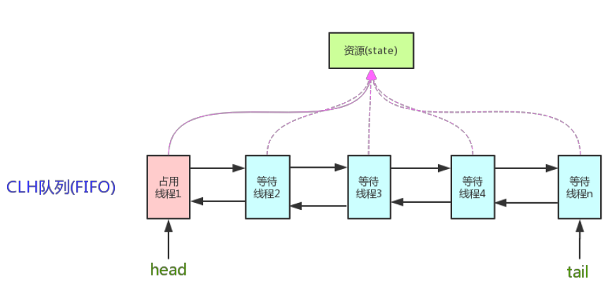

# 锁

锁用来控制多个线程访问共享资源的方式。

## 乐观锁

乐观锁是一种乐观思想，即认为**读多写少**，遇到并发写的可能性低，每次去拿数据的时候都认为别人不会修改，所以不会上锁，但是在更新的时候会判断一下在此期间别人有没有去更新这个数据，采取在写时先读出当前版本号，然后加锁操作（比较跟上一次的版本号，如果一样则更新），如果失败则要重复读-比较-写的操作。  
java中的乐观锁基本都是通过CAS操作实现的，CAS是一种更新的原子操作，比较当前值跟传入值是否一样，一样则更新，否则失败。

## 悲观锁

悲观锁是就是悲观思想，即认为**写多**，遇到并发写的可能性高，每次去拿数据的时候都认为别人会修改，所以每次在读写数据的时候都会上锁，这样别人想读写这个数据就会阻塞直到拿到锁。  

## 自旋锁

如果持有锁的线程能在很短时间内释放锁资源，那么那些等待竞争锁的线程就不需要做内核态和用户态之间的切换进入阻塞挂起状态，它们只需要等一等（自旋），等持有锁的线程释放锁后即可立即获取锁，这样就避免用户线程和内核的切换的消耗。  

>由于需要限制不同的程序之间的访问能力, 防止他们获取别的程序的内存数据, 或者获取外围设备的数据, 并发送到网络, CPU划分出两个权限等级:用户态和内核态：
**内核态**：CPU可以访问内存所有数据, 包括外围设备, 例如硬盘, 网卡. CPU也可以将自己从一个程序切换到另一个程序  
**用户态**：只能受限的访问内存, 且不允许访问外围设备. 占用CPU的能力被剥夺, CPU资源可以被其他程序获取  
用户态与内核态的切换
所有用户程序都是运行在用户态的, 但是有时候程序确实需要做一些内核态的事情, 例如从硬盘读取数据, 或者从键盘获取输入等.，而唯一可以做这些事情的就是操作系统, 所以此时程序就需要先操作系统请求以程序的名义来执行这些操作（比如java的I/O操作底层都是通过native方法来调用操作系统）。

线程自旋是需要消耗cup的，说白了就是让cup在做无用功，如果一直获取不到锁，那线程也不能一直占用cup自旋做无用功，所以需要设定一个自旋等待的最大时间。  
如果持有锁的线程执行的时间超过自旋等待的最大时间仍没有释放锁，就会导致其它争用锁的线程在最大等待时间内还是获取不到锁，这时争用线程会停止自旋进入阻塞状态。
> 适应性自旋锁：不是固定的自旋时间，而是根据前一次在同一个锁上的自旋时间以及锁的拥有者状态决定，还针对CPU的复合情况做了优化。

## 公平锁

公平锁指的是锁的分配机制是公平的，通常先对锁提出获取请求的线程会先被分配到锁。加锁前检查是否有排队等待的线程，优先排队等待的线程，先来先得。

## 非公平锁

JVM 按随机、就近原则分配锁的机制则称为不公平锁。加锁时不考虑排队等待问题，直接尝试获取锁，获取不到自动到队尾等待。

1. 非公平锁性能比公平锁高5~10倍，因为公平锁需要在多核的情况下维护一个队列
2. Java 中的`synchronized`是非公平锁，`ReentrantLock`默认是非公平锁。

## 可重入锁

可重入锁，也叫做递归锁，指的是同一线程外层函数获得锁之后 ，内层递归函数仍然有获取该锁的代码，但不受影响。

## 独占锁

独占锁模式下，每次只能有一个线程能持有锁，`ReentrantLock`就是以独占方式实现的互斥锁。独占锁是一种悲观保守的加锁策略，它避免了读/读冲突，如果某个只读线程获取锁，则其他读线程都只能等待，这种情况下就限制了不必要的并发性，因为读操作并不会影响数据的一致性。

## 共享锁

共享锁则允许多个线程同时获取锁，并发访问共享资源，如：`ReadWriteLock`。共享锁则是一种乐观锁，它放宽了加锁策略，允许多个执行读操作的线程同时访问共享资源。

1. AQS的内部类`Node`定义了两个常量`SHARED`和`EXCLUSIVE`，他们分别标识AQS队列中等待线程的锁获取模式。
2. java 的并发包中提供了`ReadWriteLock`，读-写锁。它允许一个资源可以被多个读操作访问，或者被一个写操作访问，但两者不能同时进行。

## 重量级锁

`synchronized`是通过对象内部的一个叫做监视器锁（monitor）来实现的。但是监视器锁本质又是依赖于底层的操作系统的Mutex Lock来实现的。而操作系统实现线程之间的切换这就需要从用户态转换到核心态，这个成本非常高，状态之间的转换需要相对比较长的时间，这就是为什么`synchronized`效率低的原因。因此，这种依赖于操作系统Mutex Lock所实现的锁我们称之为“重量级锁”。JDK 中对`synchronized`做的种种优化，其核心都是为了减少这种重量级锁的使用。  
JDK1.6 以后，为了减少获得锁和释放锁所带来的性能消耗，提高性能，引入了“轻量级锁”和“偏向锁”。

## 轻量级锁

锁的状态总共有四种：无锁状态、偏向锁、轻量级锁和重量级锁。
>锁升级（锁膨胀）  
随着锁的竞争，锁可以从偏向锁升级到轻量级锁，再升级到重量级锁（但是锁的升级是单向的，也就是说只能从低到高升级，不会出现锁的降级）。

“轻量级”是相对于使用操作系统互斥量Mutex Lock来实现的传统锁而言的。但是，首先需要强调一点的是，轻量级锁并不是用来代替重量级锁的，它的本意是在没有多线程竞争的前提下，减少传统的重量级锁使用产生的性能消耗。在解释轻量级锁的执行过程之前，先明白一点，轻量级锁所适应的场景是线程交替执行同步块的情况，如果存在同一时间访问同一锁的情况，就会导致轻量级锁膨胀为重量级锁。

## 偏向锁（JDK15 已废弃）

Hotspot的作者经过以往的研究发现大多数情况下锁不仅不存在多线程竞争，而且总是由同一线程多次获得。偏向锁的目的是在某个线程获得锁之后，消除这个线程锁重入（CAS）的开销，看起来让这个线程得到了偏护。引入偏向锁是为了在无多线程竞争的情况下尽量减少不必要的轻量级锁执行路径，因为轻量级锁的获取及释放依赖多次CAS原子指令，而偏向锁只需要在置换ThreadID的时候依赖一次CAS原子指令（由于一旦出现多线程竞争的情况就必须撤销偏向锁，所以偏向锁的撤销操作的性能损耗必须小于节省下来的CAS原子指令的性能消耗）。上面说过，轻量级锁是为了在线程交替执行同步块时提高性能，而偏向锁则是在只有一个线程执行同步块时进一步提高性能。

当一个线程访问同步块并获取锁时，会在对象头和栈帧中的锁记录里存储锁偏向的线程ID，以后该线程在进入和退出同步块时不需要进行CAS操作来加锁和解锁，只需要简单测试一下对象头里是否又指向当前线程的偏向锁。如果成功，则表示已经获取了锁，如果失败，则再测试下对象头存储的是否时偏向锁，如果不是，使用CAS竞争锁，如果是，尝试CAS置换ThreadID，将对象头的偏向锁指向当前线程。这是一种等到竞争出现才释放锁的机制。

> 为什么JDK15废弃偏向锁？  
受益于偏向锁的应用程序，往往是使用了早期Java集合API的程序（JDK 1.1），这些 API（HashTable和Vector）每次访问时都进行同步。JDK 1.2 引入了针对单线程场景的非同步集合（HashMap 和 ArrayList），JDK 1.5 针对多线程场景推出了性能更高的并发数据结构。这意味着如果代码更新为使用较新的类，没有了之前一些不必要的同步，性能已经大大提高，偏向锁的性能提高意义不大。此外，围绕线程池队列和工作线程构建的应用程序，性能通常在禁用偏向锁的情况下变得更好。  
偏向锁为同步系统引入了许多复杂的代码，并且对HotSpot的其他组件产生了影响。这种复杂性已经成为理解代码的障碍，也阻碍了对同步系统进行重构。

## 分段锁

分段锁也并非一种实际的锁，而是一种思想，ConcurrentHashMap（1.7）就是使用了分段锁思想。

## 锁优化

* 减少锁持有时间 - 只用在有线程安全要求的程序上加锁
* 减少颗粒度 - 将大对象（这个对象可能会被很多线程访问），拆成小对象，大大增加并行度，降低锁竞争。降低了锁的竞争，偏向锁，轻量级锁成功率才会提高。最最典型的减小锁粒度的案例就是ConcurrentHashMap（1.7）。
* 锁分离 - 最常见的锁分离就是读写锁ReadWriteLock，根据功能进行分离成读锁和写锁，这样读读不互斥，读写互斥，写写互斥，即保证了线程安全，又提高了性能。读写分离思想可以延伸，只要操作互不影响，锁就可以分离。比如LinkedBlockingQueue 从头部取出，从尾部放数据。
* 锁粗化 - 通常情况下，为了保证多线程间的有效并发，会要求每个线程持有锁的时间尽量短，即在使用完公共资源后，应该立即释放锁。但是，凡事都有一个度，如果对同一个锁不停的进行请求、同步和释放，其本身也会消耗系统宝贵的资源，反而不利于性能的优化 。
* 锁消除 - 锁消除是在编译器级别的事情。在即时编译器时，如果发现不可能被共享的对象，则可以消除这些对象的锁操作，多数是因为程序员编码不规范引起。

## synchronized同步锁

同一时间只有一个线程可以执行synchronized方法或者synchronized（this）同步代码块中的代码,对其他synchronized同步方法或synchronized（this）同步代码块调用呈阻塞状态.

* 普通同步方法（e.g, `public synchronized void methodA()`）
  * 实际锁定的是该方法的this对象，会导致该对象其他synchronized方法的访问也被阻塞
  * 可以重入(包含子类重入父类)
  * 不支持继承
* 静态同步方法
  * 锁是当前类的Class对象。
  * 对Class的所有对象实例起作用（即`objectA`和`objectB`都调用同一个静态同步`synchronized`方法或`synchronized(class)`代码块）
  * JVM具有String常量池缓存的功能，所以不建议使用`synchronized(String)`，防止“不一样”的string落到一个锁上
* 同步方法块，e,g. synchronized(x)
  * 锁是`synchronized(xxx)`括号里配置的对象`xxx`。  
  * 当多个线程同时执行`synchronized(xxx){}`同步代码块时呈同步效果
  * 当其他线程执行`xxx`对象中的`synchronized`其他同步方法呈同步效果
  * 当其他线程执行`xxx`对象方法里面的`synchronized(this)`代码块时也呈同步效果

`synchronized`是非公平锁。`synchronized`在线程进入竞争队列时，会尝试自旋获取锁。如果获取不到就进入竞争队列。  
每个对象都有个monitor对象，加锁就是在竞争monitor对象，代码块加锁是在前后分别加上`monitorenter`和`monitorexit`指令来实现的，方法加锁是通过一个标记位来判断的。  
`synchronized`是一个重量级操作，需要调用操作系统相关接口，性能是低效的，有可能给线程加锁消耗的时间比有用操作消耗的时间更多。  
Java1.6对`synchronized`进行了很多的优化，有适应自旋、锁消除、锁粗化、轻量级锁及偏向锁等，效率有了本质上的提高。在之后推出的Java1.7 与1.8 中，均对该关键字的实现机理做了优化。引入了偏向锁和轻量级锁。都是在对象头中有标记位，不需要经过操作系统加锁。JDK 1.6 中默认是开启偏向锁和轻量级锁，可以通过-XX:-UseBiasedLocking 来禁用偏向锁。  
锁可以从偏向锁升级到轻量级锁，再升级到重量级锁。这种升级过程叫做锁膨胀；

## `Lock`接口

`Lock`接口提供的`synchronized`不具备的主要特性
| 特性 | 描述 |
| -- | -- |
| 尝试非阻塞地获取锁 | 当前线程尝试获取锁，如果这一时刻锁没有被其他线程获取到，则成功获取并持有锁 |
| 能被中断地获取锁 | 与`synchronized`不同，获取到锁的线程能够响应中断，当获取到锁的线程被中断时，中断异常将会被抛出，同时锁会释放 |
| 超时获取锁 | 在指定的截止时间之前获取锁，如果截止时间到了仍旧无法获取锁，则返回 |

`Lock` API
| 方法名称 | 描述 |
| -- | -- |
| void lock() | 获取锁，调用该方法当前线程将会获取锁，当锁获得后，从该方法返回 |
| void lockInterruptibly() throws InterruptedException | 可中断地获取锁，和lock()方法不同之处在于该方法会响应中断，即在锁的获取中可以中断当前线程 |
| boolean tryLock() | 尝试非阻塞的获取锁，调用该方法后立即返回，如果能够获取则返回true，否则false |
| boolean tryLock(long time, TimeUnit unit) throws InterruptedException | 超时获取锁，当前线程在以下三种情况会返回：当前线程在超时时间内获得了锁；当前线程在超时时间内被中断；超时时间结束，返回false |
| void unlock() | 释放锁 |
| Condition newCondition() | 获取等待通知组件，该组件和当前的锁绑定，当前线程只有获得了锁，才能调用该组件的wait()方法，而调用后，当前线程将释放锁 |

## AQS队列同步器

`AbstractQueueSynchronizer`是用来构建锁或者其他同步组件的基础框架，许多同步类实现都依赖于它，如常用的`ReentrantLock`，`Semaphore`，`CountDownLatch`。AQS定义了一个`volatile int state`成员变量表示同步状态，通过内置的FIFO双向队列CLH，多线程争用资源被阻塞时会进入此队列）来完成线程的排队工作。


AQS是基于模板方法模式的，使用者需要继承AQS并重写指定的方法，随后将同步器组合在自定义同步组件的实现中，并调用同步器提供的模板方法，而这些模板方法将会调用使用者重写的方法。重写同步器指定的方法时，需要使用同步器提供的如下3个方法来访问或修改同步状态：

* `getState()`: 获取当前同步状态
* `setState(int newState)`：设置当前同步状态
* `compareAndSetState(int expect,int update)`：使用CAS设置当前状态，该方法能够保证状态设置的原子性

同步器可重写的方法（`AbstractQueueSynchronizer`没有实现这些方法）：
| 方法名称 | 描述 |
| -- | -- |
| `protected boolean tryAcquire(int arg)` | 独占式获取同步状态，实现该方法需要查询当前状态并判断同步状态是否符合预期，然后再进行CAS设置状态 |
| `protected boolean tryRelease(int arg)` | 独占式释放同步状态，等待获取同步状态的线程将有机会获取同步状态 |
| `protected int tryAcquireShared(int arg)` | 共享式获取同步状态，返回大于等于0的值，表示获取成功，反之，获取失败 |
| `protected boolean tryReleaseShared(int arg)` |共享式释放同步状态 |
| `protected boolean isHeldExclusively()` |当前同步器是否在独占模式下被线程占用，一般该方法表示是否被当前线程所独占 |

实现自定义同步组件时，将会调用同步器提供的模板方法，这些模板方法与描述如表：
| 方法名称 | 描述 |
| -- | -- |
| `public final void acquire(int arg)` | 独占式获取同步状态，如果当前线程获取同步状态成功，则由该方法返回，否则，将会进入同步队列等待，该方法将会调用重写的`tryAcquire(int arg)`方法 |
| `public final void acquireInterruptibly(int arg)` | 与`acquire(int)`相同，但是该方法响应中断，当前线程未获取到同步状态而进入同步队列中，如果当前线程被中断，则该方法会抛出`InterruptedException`异常 |
| `public final boolean tryAcquireNanos(int arg, long nanosTimeout)` | 在`acquireInterruptibly(int arg)`基础上增加了超时限制，如果当前线程在超时时间内没有获取到同步状态，那么将会返回`false`，如果获取到了返回`true` |
| `public final void acquireShared(int arg)` | 共享式地获取同步状态，如果当前线程未获取到同步状态，将会进入同步队列等待，与独占式获取的主要区别是在同一时候可以有多个线程获取到同步状态 |
| `public final void acquireSharedInterruptibly(int arg)` | 与 `acquireShared(int arg)`相同，该方法响应中断 |
| `public final boolean tryAcquireSharedNanos(int arg, long nanosTimeout)` | 与 `acquireSharedInterruptibly(int arg)`相同，增加了超时限制 |
| `public final boolean release(int arg)` | 独占式地释放同步状态，该方法会在释放同步状态之后，将同步队列中第一个节点包含的线程唤醒 |
| `public final boolean releaseShared(int arg)` | 共享式地释放同步状态 |
| `public final Collection<Thread> getQueuedThreads()` | 获取等待在同步队列上的线程集合 |

## ReentrantLock

`ReentantLock`继承接口`Lock`并实现了接口中定义的方法，是一种可重入锁(独享锁，排他)，除了能完成`synchronized`所能完成的所有工作外，还提供了诸如可响应中断锁、可轮询锁请求、定时锁等避免多线程死锁的方法。

```java
public class ReentrantLock implements Lock, java.io.Serializable {
    
    private final Sync sync; // 同步器提供所有实现

    abstract static class Sync extends AbstractQueuedSynchronizer { // 继承AQS的抽象类

        // ...
        abstract boolean initialTryLock(); // 检查可重入性，如果锁能在公平和不公平规则下立即获取，则获取锁。锁定方法(lock(), lockInterruptibly(), tryLockNanos())在依赖对应的AQS获取方法(acquire()， acquireInterruptibly(),tryAcquireNanos())之前执行initialTryLock()。
    }
       
    static final class NonfairSync extends Sync {
        // ...
    }

    static final class FairSync extends Sync {
        // ...
    }

    public ReentrantLock() {
        sync = new NonfairSync(); // 默认非公平锁
    }

  
    public ReentrantLock(boolean fair) {
        sync = fair ? new FairSync() : new NonfairSync();
    }

    // ...

}
```

## ReadWriteLock读写锁

为了提高性能，Java 提供了读写锁，在读的地方使用读锁，在写的地方使用写锁，灵活控制，如果没有写锁的情况下，读是无阻塞的,在一定程度上提高了程序的执行效率。读写锁维护了一对锁，一个读锁和一个写锁，多个读锁不互斥，读锁与写锁互斥。

Java 中读写锁有个接口java.util.concurrent.locks.ReadWriteLock， 也有具体的实现ReentrantReadWriteLock。

```java
public class ReentrantReadWriteLock implements ReadWriteLock, java.io.Serializable {
  
    private final Sync sync; // 同步器提供所有实现
    
    public ReentrantReadWriteLock() {
        this(false);
    }

    public ReentrantReadWriteLock(boolean fair) {
        sync = fair ? new FairSync() : new NonfairSync();
        readerLock = new ReadLock(this);
        writerLock = new WriteLock(this);
    }
   
    abstract static class Sync extends AbstractQueuedSynchronizer { // 继承AQS的抽象类
        // AQS的status是int型，分为读写锁，前16位用于读锁，后16位用于写锁
    }
       
    static final class NonfairSync extends Sync {
        // ...
    }

    static final class FairSync extends Sync {
        // ...
    }

    public static class ReadLock implements Lock, java.io.Serializable {
        // ...
    }
    
    public static class WriteLock implements Lock, java.io.Serializable {
        // ...
    }
    
    // ...

}
```

## LockSupport工具

当需要阻塞或唤醒一个线程的时候，都会使用LockSupport工具类。LockSupport定义了一组公共静态方法，提供最基本的线程阻塞和唤醒功能，而LockSupport也成为构建同步组件的基础工具。

LockSupport提供的阻塞和唤醒方法
| 方法名称 | 描述 |
| -- | -- |
| void park() | 阻塞当前线程，如果调用unpark(Thread thread)方法或者当前线程被中断，才能从park()方法返回 |
| void parkNanos(long nanos) | 阻塞当前线程，最长不超过nanos纳秒，返回条件在park()基础上增加了超时返回 |
| void parkUntil(long deadline) | 阻塞当前线程，直到deadline时间（从1970年开始到deadline时间的毫秒数） |
| void unpark() | 唤醒处于阻塞状态的线程thread |

Java 6 中增加了park(Object blocker)、parkNanos(Object blocker, long nanos)和parkUntil(Object blocker, long deadline)3个方法，用于实现阻塞当前线程的功能，其中参数blocker是用来标识当前线程正在等待的对象。

## Condition接口

Condition接口提供了类似Object的监视器方法，与Lock配合可以实现等待/通知模式。

```java
Lock lock = new ReentrantLock();
Condition condition = lock.newCondition();

public void conditionWait() throws InterruptedException {
    lock.lock();
    try {
        condition.await(); // 当前进程进入等待状态
    } finally {
        lock.unlock();
    }
}

public void condtionSignal() throws InterruptedException {
    lock.lock();
    try {
        condition.signal(); // 唤醒一个等待在condition上的线程
    } finally {
        lock.unlock();
    }
}
```

Condition类和Object类锁方法区别

1. Condition 类的awiat 方法和Object 类的wait 方法等效
2. Condition 类的signal 方法和Object 类的notify 方法等效
3. Condition 类的signalAll 方法和Object 类的notifyAll 方法等效
4. Condition类可以唤醒指定条件的线程（一个锁可以有多个Condition），而object的唤醒是随机的

## synchronized与ReentrantLock区别

共同点：

1. 都是用来协调多线程对共享对象、变量的访问
2. 都是可重入锁，同一线程可以多次获得同一个锁
3. 都保证了可见性和互斥性

不同点：

1. 底层实现：  
synchronized 是JVM层面的锁，是Java关键字，通过monitor对象来完成（monitorenter与monitorexit），对象只有在同步块或同步方法中才能调用wait/notify方法。  
ReentrantLock 是从jdk1.5以来（java.util.concurrent.locks.Lock）提供的API层面的锁。  
synchronized 的实现涉及到锁的升级，具体为无锁、偏向锁、自旋锁、向OS申请重量级锁。  
ReentrantLock实现则是通过利用CAS（CompareAndSwap）自旋机制保证线程操作的原子性和volatile保证数据可见性以实现锁的功能。
2. 是否可手动释放：  
synchronized：不需要用户去手动释放锁，synchronized 代码执行完后系统会自动让线程释放对锁的占用。  
ReentrantLock则需要用户去手动释放锁，如果没有手动释放锁，就可能导致死锁现象。一般通过lock()和unlock()方法配合try/finally语句块来完成，使用释放更加灵活。  
3. 是否可中断：  
synchronized是不可中断类型的锁，除非加锁的代码中出现异常或正常执行完成。  
ReentrantLock则可以中断，可通过trylock(long timeout,TimeUnit unit)设置超时方法或者将lockInterruptibly()放到代码块中，调用interrupt方法进行中断。
4. 是否公平锁：  
synchronized为非公平锁  
ReentrantLock则即可以选公平锁也可以选非公平锁，通过构造方法new ReentrantLock时传入boolean值进行选择，为空默认false非公平锁，true为公平锁。
5. 锁是否可绑定条件Condition：  
synchronized不能绑定。  
ReentrantLock通过绑定Condition结合await()/singal()方法实现线程的精确唤醒，而不是像synchronized通过Object类的wait()/notify()/notifyAll()方法要么随机唤醒一个线程要么唤醒全部线程。
