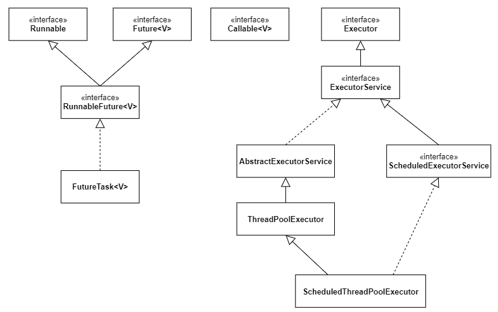
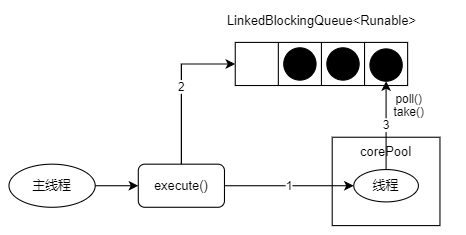
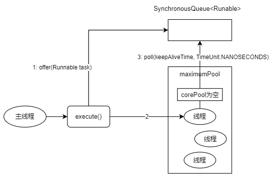
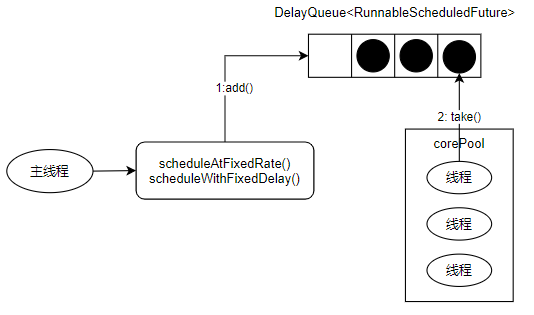

# Executor框架

## 1 简介

### Executor框架的两级调度模型

HotSpot JVM的线程模型中，Java线程（`java.lang.Thread`）被一对一映射为本地OS线程。  
在上层，Java多线程程序将应用分解为若干个任务，然后使用用户级别的调度器（`Executor`框架）将这些任务映射为固定数量的线程；在底层，OS内核将这些线程映射到硬件处理器上。  
应用程序通过`Executor`框架控制上层的调度，OS内核控制下层的调度，下层的调度不受应用程序的控制。

### Executor框架的结构和成员

#### 结构

`Executor`框架主要由三大部分组成：

* 任务 - 包括被执行任务需要实现的接口：`Runnable`和`Callable`接口。
* 任务的执行 - 包括`Executor`，继承`Executor`的`ExecutorService`接口。`ThreadPoolExecutor`和`ScheduledThreadPoolExecutor`类是实现`ExecutorService`接口的两个关键类。
* 异步计算的接口 - 包括接口`Future`和实现`Future`接口的`FutureTask`类。



* `Executor` -` Executor`框架的基础，将任务的提交与执行分离开来。
* `ThreadPoolExecutor` - 线程池的核心实现类，用来执行被提交的任务。
* `ScheduledThreadPoolExecutor` - 实现类，在给定的延时后运行命令，或者定期执行命令。比`Timer`更灵活，功能更强大。
* `Future` & `FutureTask` - 异步计算的结果。
* `Runnable`和`Callable`接口的实现类 - 可以被`ThreadPoolExecutor`或`ScheduledThreadPoolExecutor`执行。

`Executor`框架使用


主线程首先创建`Runnable`或者`Callable`接口的任务对象。工具类`Executors`可以把一个`Runnable`对象封装成`Callable`对象。

```java
public static Callable<Object> callable(Runnable task) {...}

public static <T> Callable<T> callable(Runnable task, T result) {...}
```

然后可以把`Runnable对`象直接交给`ExecutorService`执行（`execute(Runnable command)`）；也可以把`Runnable`对象或`Callable`对象提交给`ExecutorService`执行（`submit(Runnable task)` 或`submit(Callable<T> task)`）。  
如果执行的是`submit()`，`ExecutorService`将返回一个`Future`接口的对象（`FutreTask`对象）。由于`FutureTask`实现了`Runnable`，也可以自己创建`FutureTask`，交给`ExecutorService`执行。  
最后，主线程可以执行`FutureTask.get()`来等待任务执行完成，或者`FutureTask.cancel(boolean mayInterruptIfRunning)`来取消任务。

#### 成员

1. `ThreadPoolExecutor`  
    `ThreadPoolExecutor`通常使用工厂类`Executors`来创建。`Executors`可以创建3种类型的`ThreadPoolExecutor`：`SingleThreadExecutor`、`FixedThreadPool`和`CachedThreadPool`。  
    a. **FixedThreadPool** - 固定线程数，适用于为了满足资源管理的需求，而需要限制当前线程数量的应用场景，适合于负载比较重的服务器。

    ```java
    public static ExecutorService newFixedThreadPool(int nThreads)
    public static ExecutorService newFixedThreadPool(int nThreads, ThreadFactory threadFactory)
    ```

    b. **SingleThreadExecutor** - 单线程，适用于需要保证顺序地执行各个任务；并且任意时间点，不会有多个线程活动的场景。

    ```java
    public static ExecutorService newSingleThreadExecutor()
    public static ExecutorService newSingleThreadExecutor(ThreadFactory threadFactory)
    ```

    c. **CachedThreadPool** - 根据需要创建新线程，是大小无界的线程池，适用于执行很多的短期异步任务的小程序，或者是负载较轻的服务器。

    ```java
    public static ExecutorService newCachedThreadPool()
    public static ExecutorService newCachedThreadPool(ThreadFactory threadFactory)
    ```

2. `ScheduledThreadPoolExecutor`  
    `ScheduledThreadPoolExecutor`通常使用工厂类`Executors`来创建。`Executors`可以创建2种类型的`ScheduledThreadPoolExecutor`：`ScheduledThreadPoolExecutor`，`SingleThreadScheduledExecutor`。  
    a. **ScheduledThreadPoolExecutor** - 适用于需要多个后台线程执行周期任务，同时为了满足资源管理的需求而需要限制后台线程的数量的应用场景。

    ```java
    public static ScheduledExecutorService newScheduledThreadPool(int corePoolSize)
    public static ScheduledExecutorService newScheduledThreadPool(int corePoolSize, ThreadFactory threadFactory)     
    ```

    b. **SingleThreadScheduledExecutor** - 适用于需要单个后台线程执行周期任务，同时需要保证顺序地执行各个任务的场景。

    ```java
    public static ScheduledExecutorService newSingleThreadScheduledExecutor()
    public static ScheduledExecutorService newSingleThreadScheduledExecutor(ThreadFactory threadFactory)     
    ```

3. `Future`接口  
   `Future`接口和实现`Future`接口的`FutureTask`类用来表示异步计算的结构。当把`Runnable`接口或`Callable`接口的实现类提交（`submit`）给`ThreadPoolExecutor`或`ScheduledThreadPoolExecutor`时，会返回一个`FutureTask`对象。（注意，实际API声明是返回`Future`实现对象）

    ```java
    <T> Future<T> submit(Callable<T> task);
    <T> Future<T> submit(Runnable task, T result);
    <T> Future<T> submit(Runnable task);  
    ```

4. `Runnable`接口 & `Callable`接口  
   `Runnable`接口或`Callable`接口的实现类，都可以被ThreadPoolExecutor或ScheduledThreadPoolExecutor执行。  
   除了可以自己创建Callable接口对象外，还可以使用工厂类Executors来把Runnable包装成一个Callable.

    ```java
    public static Callable<Object> callable(Runnable task) // submit后，对返回的FutureTask执行get,得到null
    public static <T> Callable<T> callable(Runnable task, T result) // submit后，对返回的FutureTask执行get,得到result
    ```

## 2. ThreadPoolExecutor详解

由4个组件构成：

* `corePoolSize` - 核心线程池大小
* `maximumPoolSize` - 最大线程池大小
* `BlockingQueue` - 暂时保存任务的工作队列
* `RejectedExecutionHandler` - 当`ThreadPoolExecutor`已经关闭或`ThreadPoolExecutor`已经饱和（达到最大线程池大小并且工作队列已满），`execute()`方法调用的`Handler`。

任何BlockingQueue都可以用来传输和保存提交的任务。这个队列的使用与池大小相互作用:

* 如果运行的线程少于corePoolSize，执行程序总是喜欢添加一个新线程，而不是排队。
* 如果corePoolSize或更多的线程正在运行，执行程序总是倾向于将请求排队，而不是添加一个新线程。
* 如果一个请求不能排队，一个新的线程将被创建，除非这个线程将超过maximumPoolSize，在这种情况下，任务将被拒绝。

### 2.1 FixedThreadPool详解

可重用固定线程数的线程池。

```java
public static ExecutorService newFixedThreadPool(int nThreads) {
        return new ThreadPoolExecutor(nThreads, nThreads,
                                      0L, TimeUnit.MILLISECONDS,
                                      new LinkedBlockingQueue<Runnable>());
    }
```

`corePoolSize`和`maximumPoolSize`都被设置为创建时指定的参数`nThreads`。  
*当线程数大于`corePoolSize`时*，`keepAliveTime`为多余的空闲线程等待新任务的最长时间，超过这个时间后多余的线程将被终止 *(【jasmine：所谓多余的线程是指大于`corePoolSize`并且小于`maximumPoolSize`时候的线程，也就是说默认核心线程不回收。如果要设置核心线程的回收，则需要设置`executor.allowCoreThreadTimeOut(true)`，但这是`keepAliveTime`必须要>0才行，否则会抛出异常】)*。这里`keepAliveTime`为0L，表示多余的空闲线程会被立即终止。*(【jasmine：其实不会走到这里，因为线程数不会大于`corePoolSize`】)*  


1. 如果当前线程数少于`corePoolSize`，则创建新线程来执行任务。
2. 在线程池完成预热（当前运行的线程数等于`corePoolSize`），将任务加入`LinkedBlockingQueue`。
3. 线程执行完1的任务后，会循环反复从`LinkedBlockingQueue`获取任务来执行。

FixedThreadPool使用无界队列`LinkedBlockingQueue`作为线程池的工作队列（队列的容量为Integer.MAX_VALUE）。使用无界队列会由如下影响：  

1) 当线程池钟的线程数达到`corePoolSize`后，新任务将在无界队列中等待，因此线程池中的线程数不会超过`corePoolSize`。
2) 由于1，`maximumPoolSize`参数无效。
3) 由于1和2，`keepAliveTime`参数无效。
4）由于使用无界队列，运行中的`FixedThreadPool`（未执行方法`shutdown()`或`shutdownNow()`）不会拒绝任务（不会调用`RejectedExecutionHandler.rejectExecution`方法）。

### 2.2 SingleThreadExecutor详解

使用单个`worker`线程的`Executor`。

```java
public static ExecutorService newSingleThreadExecutor() {
    return new FinalizableDelegatedExecutorService
        (new ThreadPoolExecutor(1, 1,
                                0L, TimeUnit.MILLISECONDS,
                                new LinkedBlockingQueue<Runnable>()));
}
```

`corePoolSize`和`maximumPoolSize`都被设置为`1`。其他参数跟`FixedThreadPool`相同，也使用无界队列`LinkedBlockingQueue`作为线程池工作队列。  


### 2.3 CachedThreadPool详解

根据需要创建新线程的线程池。

```java
public static ExecutorService newCachedThreadPool() {
    return new ThreadPoolExecutor(0, Integer.MAX_VALUE,
                                  60L, TimeUnit.SECONDS,
                                  new SynchronousQueue<Runnable>());
}
```

`corePoolSize`被设置为`0`，`maximumPoolSize`被设置为`Integer.MAX_VALUE`，即`maximumPoolSize`是无界的。`keepAliveTime`设置为60L，意味着CachedThreadPool中的空闲线程等待新任务的最长实际是60秒，超过将被终止。  
CachedThreadPool使用没有容量的SynchronousQueue作为线程池的工作队列，但是`maximumPoolSize`是无界的，这意味着，如果主线程提交任务的速度高于maximumPool处理任务的速度时，CachedThreadPool将会不断创建线程。极端情况下，CachedThreadPool会因为创建过多线程而耗尽CPU和内存资源。



CachedThreadPool-execute.png

1) 首先执行`SynchronousQueue.offer(Runnable task)`。如果maximumPool中由空闲线程正在执行`SynchronousQueue.poll(keepAliveTimer, TimeUnit.NANOSECONDS)`，那么主线程执行offer操作和空闲线程执行的`poll`操作配对成功，主线程把任务交给空闲线程执行，`execute()`方法完成；否则执行步骤2)。
2) 当初始maximumPool为空，或者maximumPool中当前没有空闲线程时，将没有线程执行`poll`操作，CachedThreadPool会创建一个新线程执行任务，`execute()`方法完成。
3) 在步骤2)中新创建的线程将任务执行完后，会执行`poll`操作。这个`poll`操作会让线程最多在SynchronousQueue等待60s。如果60s内主线程提交了一个新任务，那么该线程执行新任务；否则，线程终止。由于空闲60s的线程会被终止，因此长时间保持空闲的CachedThreadPool不会使用任何资源。

## 3 `ScheduledThreadPoolExecutor`详解

`ScheduledThreadPoolExecutor`继承自`ThreadPoolExecutor`。它主要用来在给定的延时之后运行任务，或者定期执行任务。`ScheduledThreadPoolExecutor`功能跟`Timer`类似，但更强大、灵活。`Timer`对应单个后台线程，`ScheduledThreadPoolExecutor`可以在构造函数指定多个对应的后台线程数。

```java
public ScheduledThreadPoolExecutor(int corePoolSize) {
    super(corePoolSize, Integer.MAX_VALUE,
          DEFAULT_KEEPALIVE_MILLIS, MILLISECONDS,
          new DelayedWorkQueue()); //DelayedWorkQueue：专门的延迟队列。为了与ThreadPoolExecutor声明相匹配，这个类必须声明为BlockingQueue，即使它只能保存RunnableScheduledFutures。 
}
```

### 3.1 ScheduledThreadPoolExecutor运行机制



DelayeQueue(实际是自己实现的DelayedWorkQueue)是一个无界队列，所以`ThreadPoolExecutor`的`maximumPoolSize`在`ScheduledThreadPoolExecutor`中没用。  
`ScheduledThreadPoolExecutor`的执行主要分为两大部分：

1. 当调用`ScheduledThreadPoolExecutor`的`scheduleAtFixedRate()`方法或者`scheduleWithFixedDelay()`方法时，会向`ScheduledThreadPoolExecutor`的DelayQueue添加一个实现`RunnableScheduledFutures`接口的`ScheduledFutureTask`。
2. 线程池中的线程从DelayQueue中获取`ScheduledFutureTask`，然后执行任务。

### 3.2 ScheduledThreadPoolExecutor的实现

`ScheduledThreadPoolExecutor`会把待调度的任务（`ScheduledFutureTask`）放到一个DelayQueue里面。  `ScheduledThreadPoolExecutor`主要包含3个变量：

* `time`(`long`) - 表示任务将被执行的具体实际
* `sequenceNumber`(`long`) - 表示任务被添加到`ScheduledThreadPoolExecutor`中的序号
* `period`(`long`) - 表示任务执行的间隔周期

DelayeQueue封装了一个PriorityQueue，会对队列中的`ScheduledFutureTask`排序。time小的在前，如果time相同，就比较sequenceNumber，sequenceNumber小的在前。

ScheduledThreadPoolExecutor中的线程1执行某个周期任务的过程如下图：


1) 线程1从DelayQueue获取已到期（time大于等于当前时间）的`ScheduledFutureTask`（DelayQueue.take()）。
2) 线程1执行这个`ScheduledFutureTask`。
3) 线程1修改这个`ScheduledFutureTask`的time为下次将要执行时间。
4）线程1把这个`ScheduledFutureTask`放回DelayQuque（DelayQueue.add()）。

## 4. FutureTask详解

### 4.1 FutureTask简介

`FutureTas`k除了实现`Future`接口外，还实现了`Runnable`接口。因此，`FutureTask`既可以交给`Executor`执行，也可以由调用线程直接执行（`FutureTask.run()`）。根据`FutureTask.run()`执行的时期，`FutureTask`可以处于下面3种状态：

1) **未启动** - `run()`方法执行之前
2) **已启动** - `run()`方法执行过程中
3) **已完成** - 执行完正常结束，或被取消（`FutureTask.cancel(...)`），或执行`run()`方法时抛出异常而异常结束。

当`FutureTask`处于未启动或已启动状态时，调用`get()`将导致线程阻塞；当状态为已完成时，调用`get()`将导致调用线程立即返回结果或抛出异常。  
当`FutureTask`处于未启动状态时，调用`cancel()`将导致此任务永远不会被执行；当状态为已启动时，执行`cancel(true)`将以中断来试图停止任务，执行`cancel(false)`对正在执行的线程无影响（让正在执行的任务完成）；当已完成时，执行`FutureTask.cancel(...)`将返回`false`。

当cancel(true)去以中断的方式中断任务的执行时，除非在Callable的call()方法实现上设计成响应线程中断，否则是不会中断callable.call()方法的执行的，虽然不会中断任务的执行，但是不会设置callable的运行结果，在get()方法返回时抛出CancellationException异常。(TODO: ????)

### 4.2 FutureTask的使用

`FutureTask`可以交给Executor执行；也可以通过`ExecutorService.submit(...)`方法返回一个`FutureTask`，然后执行`FutureTask.get()`方法或者`FutureTask.cancel(...)`方法；还可以单独使用`FutureTask`。  
当一个线程需要等待另一个线程把某个任务执行完后它才能继续执行，此时可以使用`FutureTask`。

### 4.2 FutureTask的实现

1.7及以前基于`AbstractQueuedSynchronizer(A`QS)，1.8重写。
