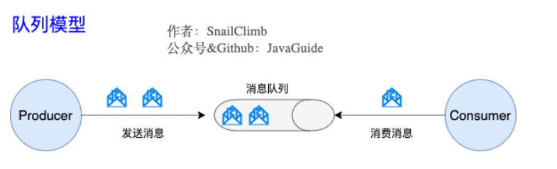
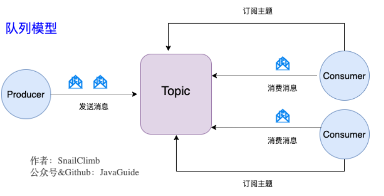
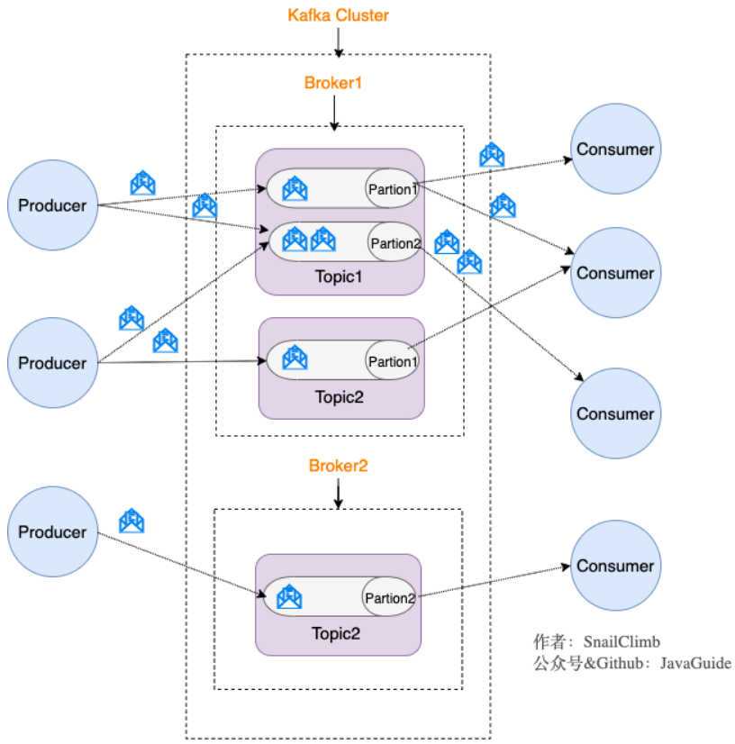

# Kafka

<!-- TOC -->
- [1. Kafka是什么？主要应用场景有哪些？](#1-Kafka是什么？主要应用场景有哪些？)  
- [2. 和其他消息队列相比，Kafka优势在哪里？](#2-和其他消息队列相比，Kafka优势在哪里？)
- [3. 队列模型了解吗？Kafka的消息模型知道吗？](#3-队列模型了解吗？Kafka的消息模型知道吗？)
- [4. 什么是Producer、Consumer、Broker、Topic、Partition？](#4-什么是Producer、Consumer、Broker、Topic、Partition？)
- [5. Kafka的多副本机制了解吗？带来了什么好处？](#5-Kafka的多副本机制了解吗？带来了什么好处？)
- [6. Kafka的多分区（Partition）以及多副本（Replica）机制有什么好处？](#6-Kafka的多分区（Partition）以及多副本（Replica）机制有什么好处？)
- [7. Kafka是如何保障数据不丢失的?](#7-Kafka是如何保障数据不丢失的?)
- [8. 如何解决Kafka数据丢失问题？](#8-如何解决Kafka数据丢失问题？)
- [9. Kafka如何保证消息不重复消费](#9-Kafka如何保证消息不重复消费)
- [10. Kafka高效文件存储设计特点](#10-Kafka高效文件存储设计特点)
- [11. partition的数据如何保存到硬盘？](#11-partition的数据如何保存到硬盘)
- [12. 消费者组概念](#12-消费者组概念)
- [13. 消费者来不及怎么办？](#13-消费者来不及怎么办)
- [14. Zookeeper在Kafka中的作用](#14-Zookeeper在Kafka中的作用)
- [15. Kafka如何保证消息的消费顺序？](#15-Kafka如何保证消息的消费顺序)
- [16. Kafka的ack机制](#16-Kafka的ack机制)
<!-- /TOC -->

## 1. Kafka是什么？主要应用场景有哪些？

Kafka是由Apache软件基金会开发的一个开源流处理平台，由Scala和Java编写。该项目的目标是为处理实时数据提供一个统一、高吞吐、低延迟的平台。其持久化层本质上是一个“按照分布式事务日志架构的大规模发布/订阅消息队列”，这使它作为企业级基础设施来处理流式数据非常有价值。此外，Kafka可以通过Kafka Connect连接到外部系统（用于数据输入/输出），并提供了Kafka Streams——一个Java流式处理库。  
Kafka是一个分布式流式处理平台，有三个关键功能：

1. **消息队列**： 发布和订阅消息流
2. **容错的持久方式存储记录消息流**：kafka会把消息持久化到磁盘，有效避免了消息丢失的风险
3. **流式处理平台**：在消息发布的时候进行处理，Kafka提供了一个完整的流式处理类库

Kafka主要有两大应用场景：

1. **消息队列**：建立实时流数据管道，以及可靠地在系统或应用程序之间获取数据
2. **数据处理**：构建实时的流数据处理程序来转换或处理数据流

## 2. 和其他消息队列相比，Kafka优势在哪里？

1. 性能
2. 生态系统兼容性

## 3. 队列模型了解吗？Kafka的消息模型知道吗？

**早期的消息模型**：使用队列（`Queue`）作为消息通信载体，满足生产者与消费者模式，一条消息只能被一个消费组使用，未被消费的消息在队列中保留直到被消费或超时。



存在的问题：如果需要把生产者的消息分发给多个消费者，并且每个消费者都能接收到完整的消息内容，不好解决。

**发布-订阅模型**：Kafka消息模型



发布订阅模型（Pub-Sub）使用**主题**（Topic）作为消息通信载体，类似于**广播模式**；发布者发布一条消息，该消息通过主题传递给所有的订阅者，**在一条消息广播之后才订阅的用户则是收不到该条消息的**。

在发布订阅模型中，如果只有一个订阅者，那它和队列模型就基本是一样的了。所以说，发布订阅模型在功能层面上是可以兼容队列模型的。

Kafka 采用的就是发布-订阅模型。

## 4. 什么是Producer、Consumer、Broker、Topic、Partition？

Kafka将生产者发布的消息发送到Topic中，需要这些消息的消费者可以订阅这些Topic。


- Producer（生产者）: 产生消息的一方。
- Consumer（消费者）: 消费消息的一方。
- Broker（代理）: 可以看作是一个独立的Kafka实例。多个Kafka Broker组成一个Kafka Cluster。  
同时，你一定也注意到每个Broker中又包含了Topic以及Partition这两个重要的概念：
- Topic（主题）：Producer将消息发送到特定的主题，Consumer通过订阅特定的Topic(主题) 来消费消息。
- Partition（分区）：Partition属于Topic的一部分。一个 Topic可以有多个Partition，并且同一Topic下的Partition可以分布在不同的Broker上，这也就表明一个Topic可以横跨多个Broker。

>划重点：Kafka 中的 Partition（分区）实际上可以对应成为消息队列中的队列。这样是不是更好理解一点？

## 5. Kafka的多副本机制了解吗？带来了什么好处？

Kafka为分区引入了多副本（Replica）机制。分区中的多个副本之间会有一个叫做leader的家伙，其他副本称为follower。我们发送的消息会被发送到leader副本，然后follow副本才能从leader副本中拉取消息进行同步。
>生产者和消费者只与leader副本交互。其他副本可以理解为只是leader副本的拷贝，它们的存在只是为了保证消息存储的安全性。当leader副本发生故障时会从follower中选举出一个leader，但是follower中如果有和leader同步程序达不到要求的不参加leader的竞选。

## 6. Kafka的多分区（Partition）以及多副本（Replica）机制有什么好处？

1. Kafka通过给特定Topic指定多个Partition，而各个Partition可以分布在不同的Broker上，这样能提供较好的并发能力（负载均衡）。
2. Partition可以指定对应的Replica数, 这也极大地提高了消息存储的安全性, 提高了容灾能力，不过也相应的增加了所需要的存储空间。

## 7. Kafka是如何保障数据不丢失的?

对于Kafka broker来说，kafka的**复制机制**和**分区的多副本**架构是Kafka可靠性保证的核心。把消息写入多个副本可以使kafka在发生崩溃时仍能保证消息的持久性。
这里主要包含三个方面：

1. topic副本因子个数：`replication.factor >= 3`
2. 同步副本列表（ISR）：`min.insync.replicas = 2`
3. 禁用unclean选举：`unclean.leader.election.enable=false`

### 副本因子

Kafka的tpoic是可以分区的，并且可以为分区（Partition）设置多个副本（Replica），该配置可以通过replication.factor参数实现。Kafka中的分区副本包含两种类型：领导者（leader）副本和追随者（follower）副本，每个分区在创建时都要选举一个副本作为领导者副本，其余的副本自动变为追随者副本。在Kafka中，追随者副本不对外提供服务，所有的请求都必须由领导者副本来处理。换句话说，所有的读写请求都必须法网领导者副本躲在的Broker，由该Broker负责处理。追随者副本不处理客户端请求，它唯一的任务就是从领导者副本**异步拉取**消息，并写入到自己的提交日志中，从而实现与领导者副本的同步。  
一般来说，副本设为3可以满足大部分的使用场景，也有可能是5个副本。如果副本因子为N，那么在N-1个Broker失效的情况下，仍然能够从主题读取数据或向主题写入数据。所以，更高的副本因子会带来更高的可用性、可靠性和更好的故障。另一方面，副本因子N至少需要N个Broker，而且会有N个数据副本，也就是说它们会占用N倍的磁盘空间，实际生产环境中一般会在可用性和存储硬件之间权衡。  
除此之外，副本的分布同样也会影响可用性。默认情况下，kafka会确保分区的每个副本分布在不同的Broker上，但是如果这些Broker在同一个机架上，一旦机架发生故障，分区就会不可用。所以建议把Broker分布在不同的机架上。

### 同步副本列表

In-Sync replica（ISR）称之为同步副本，ISR中的副本都是与Leader进行同步的副本，所以不在该列表的follower会被认为与Leader是不同步的。那么，ISR中存在的是什么副本呢？首先可以明确的是：Leader副本总是存在于ISR中，而follower副本是否在ISR中，取决于该follower副本是否与Leader副本保持了“同步”。  
kafka的broker端有一个参数`replica.lag.time.max.ms`，该参数表示follower副本滞后于Leader副本的最长时间间隔，默认是10s。这意味着，只要follower副本落后于leader副本的时间间隔不超过10s，就可以认为该follower副本与leader副本是同步的，所以哪怕当前follower副本落后于leader副本几条消息，只要在10s之内赶上leader副本，就不会被踢出局。  
可以看出ISR是一个动态的，所以即便是为分区设置3个副本，还是会出现同步副本列表中只有一个副本的情况（其他副本由于不能够与leader及时保持同步，被移出ISR列表）。如果这个同步副本变为不可用，我们必须在**可用性**和**一致性**之间做出选择（CAP理论）。  
根据Kafka 对可靠性保证的定义，消息只有在被写入到所有同步副本之后才被认为是已提交的。但如果这里的“所有副本”只包含一个同步副本，那么在这个副本变为不可用时，数据就会丢失。如果要确保已提交的数据被写入不止一个副本，就需要把最小同步副本数量设置为大一点的值。对于一个包含3个副本的主题分区，如果`min.insync.replicas=2`，那么至少要存在两个同步副本才能向分区写入数据。  
如果进行了上面的配置，此时必须要保证ISR中至少存在两个副本，如果ISR中的副本个数小于2，那么Broker就会停止接受生产者的请求。尝试发送数据的生产者会收到`NotEnoughReplicasException`异常，消费者仍然可以继续读取已有的数据。

### 禁用unclean选举

选择一个同步副本列表中的分区作为leader分区的过程称为clean leader elecion，在非同步副本中选一个分区作为leader的过程称之为unclean leader election。通常来说，非同步副本落后Leader太多，如果选择它们作为新Leader，就可能出现数据的丢失。  
在 Kafka 中，可以通过Broker端参数**unclean.leader.election.enable**控制是否允许Unclean的副本参与领导者选举。由于ISR是动态调整的，所以会存在ISR列表为空的情况。这样开启 Unclean领导者选举可能会造成数据丢失，但好处是，它使得分区 Leader 副本一直存在，不至于停止对外提供服务，提升了高可用性。反之，禁止 Unclean Leader 选举的好处在于维护了数据的一致性，避免了消息丢失，但牺牲了高可用性。分布式系统的CAP理论说的就是这种情况。

不幸的是，unclean leader election的选举过程仍可能会造成数据的不一致，因为同步副本并不是完全同步的。由于复制是异步完成的，因此无法保证follower可以获取最新消息。比如Leader分区的最后一条消息的offset是100，此时副本的offset可能不是100，这受到两个参数的影响：

- `replica.lag.time.max.ms`：同步副本滞后与leader副本的时间
- `zookeeper.session.timeout.ms`：与zookeeper会话超时时间

简而言之，如果我们允许不同步的副本成为leader，那么就要承担丢失数据和出现数据不一致的风险。如果不允许它们成为leader，那么就要接受较低的可用性，因为我们必须等待原先的Leader恢复到可用状态。

关于unclean选举，不同的场景有不同的配置方式。对数据质量和数据一致性要求较高的系统会禁用这种unclean的leader选举(比如银行)。如果在可用性要求较高的系统里，比如实时点击流分析系统， 一般不会禁用unclean的leader选举。

## 8. 如何解决Kafka数据丢失问题

### 生产者丢失消息的情况

1. `retries = LONG.MAX_VALUE`， `retry.backoff.ms`  
retries参数用来配置生产者自动重试（可重试的异常）的次数，默认是0。设置retries为一个较大的值，当出现网络的瞬时抖动时，消息发送可能失败，此时配置了`retries>0`的Producer能够自动重试消息发送，避免消息丢失。`retry.backoff.ms` 默认100s，用来设定两次重试之间的时间间隔，最好估算一下可能的异常恢复时间，避免总的重试时间小于异常恢复时间导致生产者过早地放弃重试。
2. `asks=all`  
设置acks=all，acks是Producer的一个参数，代表对“已提交”消息的定义，`all`代表所有副本都要接收到消息，该消息才算是“已提交”。这是最高等级的“已提交”定义。
3. `max.in.flight.request.per.connections=1`  
该参数指定生产者在收到服务器响应之前可以发送多少个消息，它的值越高，就会占用越多的内存，不过也会提升吞吐量。把它设为1可以保证消息是按照发送的顺序写入服务器的，即使发生重试。
4. 使用回调  
生产者(Producer) 调用`send`方法发送消息之后，消息可能因为网络问题并没有发送过去，不能默认在调用`send`方法后，消息发送成功了。为了确定消息是发送成功，我们要判断消息发送的结果。Kafka生产者(Producer) 使用`kafkaTemplate.send`方法发送消息实际上是异步的操作，如果通过`get()`方法获取调用结果，会把它变成同步操作，不推荐这样使用。推荐使用回调函数：

    ```java
    ListenableFuture<SendResult<String, Object>> future = kafkaTemplate.send(topic, o);
    future.addCallback(result -> logger.info("Message is successfully sent to topic:{} partition:{}.", result.getRecordMetadata().topic(), result.getRecordMetadata().partition()),
    ex -> logger.error("Message is failed to sent because of {}", ex.getMessage())) 
    ```

如果消息发送失败的话，检查失败的原因重新发送。

### 消费者丢失消息的情况

消息在被追加到Partition(分区)的时候都会分配一个特定的偏移量（offset），对于消费者来说，也有一个offset的概念，消费者使用offset表示消费到分区中某个消息所在的位置。当消费者拉取到了分区的某个消息之后，消费者会提交offset，往一个叫作`_consumer_offset`的特殊主题发送消息。Kafka默认的消费offset提交方式是自动提交（定时发送），自动提交会有一个问题，试想一下，当消费者刚拿到这个消息准备进行真正消费的时候，突然挂掉了，消息实际上并没有被消费，但是offset却被自动提交了。

1. `enable.auto.commit=false`  
禁用自动提交
2. 消费者处理完消息之后再提交offset
3. `auto.offset.reset`
这个参数指定了在没有偏移量可提交时（比如消费者第一次启动）或者请求的偏移量再broker上不存在时（比如数据被删了），消费者的行为。如果配置`auto.offset.reset=earliest`，消费者会从分区的开始位置读取数据，这样会导致消费者读取大量的重复数据，但可以保证最少的数据丢失；如果配置`auto.offset.reset=latest`，消费者会从分区的末尾开始读取数据，这样可以减少重复处理消息，但很有可能会错过一些消息。

关闭自动提交offset，每次在真正消费完消息之后之后自己手动提交offset会带来消息被重新消费的问题。比如你刚刚消费完消息之后，还没提交offset，结果自己挂掉了，那么这个消息理论上就会被消费两次。

## 9. Kafka如何保证消息不重复消费

1. 幂等操作，重复消费不会产生问题
2. 设置自动提交`enable.auto.commit=true`
3. 可以通过将每次消费的数据的唯一标识存入Redis中，每次消费前先判断该条消息是否在Redis中，如果有则不再消费，如果没有再消费，消费完再将该条记录的唯一标识存入Redis中，并设置失效时间，防止Redis数据过多、垃圾数据问题。

## 10. Kafka高效文件存储设计特点

1. Kafka把topic中一个parition大文件分成多个小文件段（segment），通过多个小文件段，就容易定期清除或删除已经消费完文件，减少磁盘占用。
2. 通过索引信息可以快速定位message和确定response的最大大小。
3. 通过index元数据全部映射到memory，可以避免segment file的IO磁盘操作。
4. 通过索引文件稀疏存储，可以大幅降低index文件元数据占用空间大小。

## 11. partition的数据如何保存到硬盘？

topic中的多个partition以文件夹的形式保存到broker，每个分区序号从0递增，且消息有序。Partition文件下有多个segment（xxx.index，xxx.log），segment文件大小可以配置，默认为1g，如果大小大于1g时，会滚动一个新的segment并且以上一个segment最后一条消息的偏移量命名。

## 12. 消费者组概念

是Kafka实现单播和广播两种消息模型的手段。同一个topic的数据，会广播给不同的group；同一个group中的worker，只有一个worker能拿到这个数据。换句话说，对于同一个topic，每个group都可以拿到同样的所有数据，但是数据进入group后只能被其中的一个worker消费。group内的worker可以使用多线程或多进程来实现，也可以将进程分散在多台机器上，worker的数量通常不超过partition的数量，且二者最好保持整数倍关系，因为Kafka在设计时假定了一个partition只能被一个worker消费（同一group内）。

## 13. 消费者来不及怎么办？

1. 提高消费者自身的性能，例如把同步改成异步。
2. 增加消费者、增加partition
3. 背压？

## 14. Zookeeper在Kafka中的作用

ZooKeeper主要为Kafka提供元数据的管理的功能，为Kafka做了下面这些事情：

- **Broker注册**：在Zookeeper上会有一个专门用来进行Broker服务器列表记录的节点（`brokers`）。每个Broker在启动时，都会到Zookeeper上进行注册，即到`/brokers/ids`下创建属于自己的节点，每个Broker将自己的IP地址和端口等信息记录到该节点中去。Broker创建的是临时节点，一旦Broker宕机，对应的临时节点会被自动删除。
- **Topic注册**：在Kafka中，同一个Topic的消息会被分成多个分区并将其分布在多个Broker上，这些分区信息及与Broker的对应关系也都是由Zookeeper在维护，由专门的节点来维护，如：`/brokers/topics`。比如我创建了一个名字为`my-topic`的主题并且它有两个分区，对应到`zookeeper`中会创建这些文件夹：`/brokers/topics/my-topic/Partitions/0`、`/brokers/topics/my-topic/Partitions/1`。
- **负载均衡** ：上面也说过了Kafka通过给特定Topic指定多个Partition, 而各个Partition可以分布在不同的Broker上, 这样便能提供比较好的并发能力。 对于同一个Topic的不同Partition，Kafka会尽力将这些Partition分布到不同的Broker服务器上。当生产者产生消息后也会尽量投递到不同Broker的Partition里面。当Consumer消费的时候，Zookeeper可以根据当前的Partition数量以及Consumer数量来实现动态负载均衡。

## 15. Kafka如何保证消息的消费顺序？

发送端不能异步发送，异步发送在发送失败的情况下，就没办法保证消息顺序。比如你连续发了1，2，3。 过了一会，返回结果1失败，2, 3成功。你把1再重新发送1遍，这个时候顺序就乱掉了。

每次添加消息到Partition的时候都会采用尾加法，Kafka保证Partition中的消息有序，不能保证Topic中的Partition有序。
> 消息在被追加到Partition的时候都会分配 一个特定的偏移量（offset）。Kafka通过偏移量来保证消息在分区的顺序性。

所以，最简单的保证消费顺序的方法是：1个Topic只对应一个Partition。这样可以解决问题，但是破坏了kafka设计的初衷。
向Kafka中发送一条消息的时候，可以指定topic、partition、key、data四个参数，如果发送消息的时候指定Partition的话，所有消息都会发送到指定的Partition。如果发送消息的时候指定key的话，同一个key的消息也可以保证只发送到同一个Partition中。  
总结，对于如何保证Kafka中消息消费的顺序，有两种方法：

1. 1个Topic只对应1个Partition
2. （推荐）发送消息的时候指定key或者Partition

## 16. Kafka的ack机制

`request.required.acks`有三个值`0`，`1`，`-1`。
`0`：生产者不会等待broker的ack，这个延迟最低但是存储的保证最弱。当server挂掉的时候就会丢数据。
`1`：服务端会等待`ack`值。leader副本确认接收到消息后发送`ack`，但是如果`leader`挂掉后，不确保是否复制完成，新`leader`也会导致数据丢失。
`-1`：同样在`1`的基础上，服务端会等所有的`follower`的副本收到数据后才会收到`leader`发出的`ack`，这样数据不会丢失。
