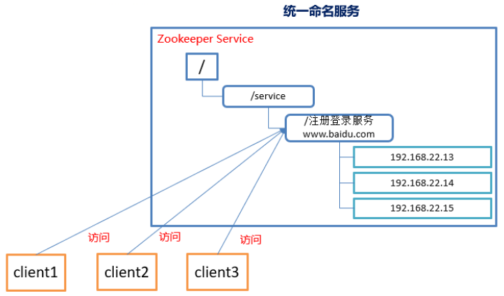
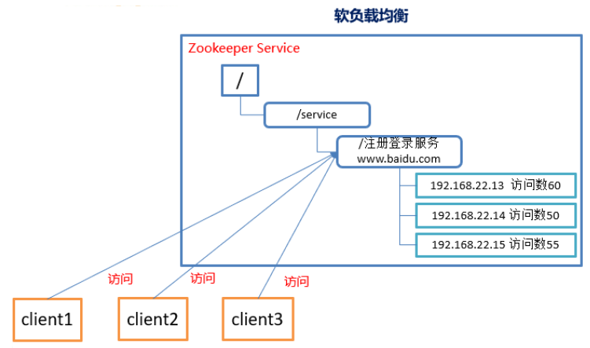
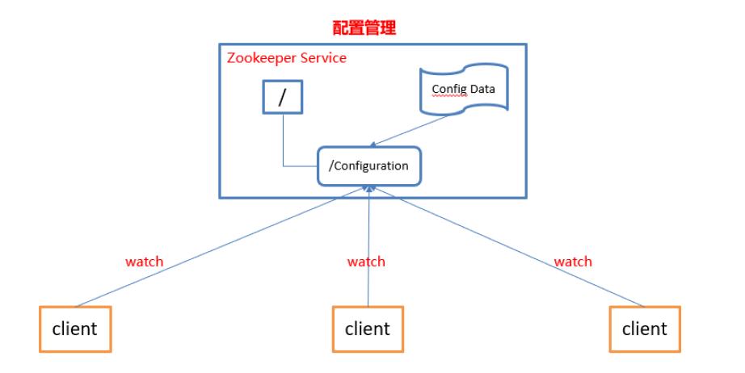
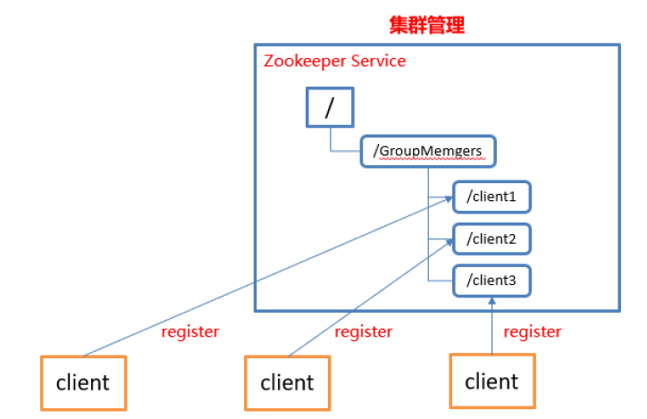
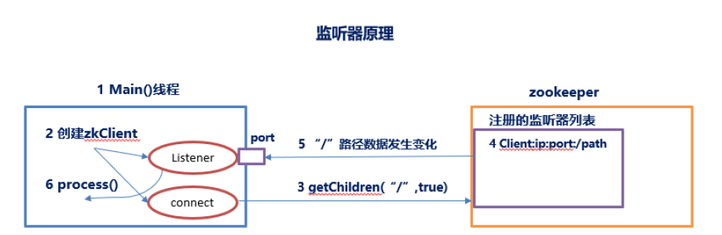
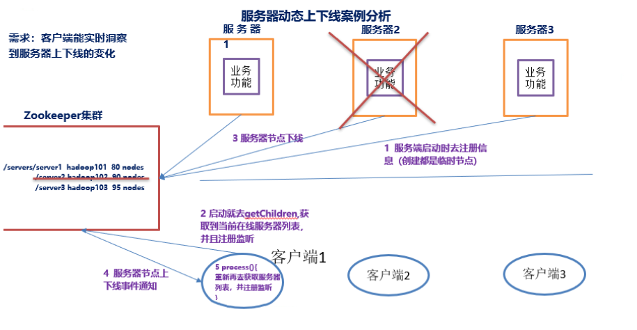
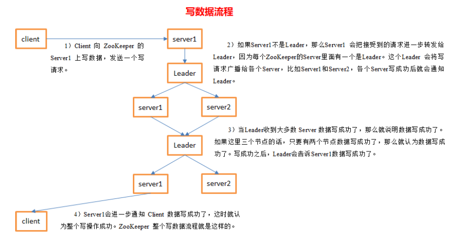

# Zookeeper

Zookeeper从设计模式角度来理解：是一个基于观察者模式设计的分布式服务管理框架，它负责存储和管理大家都关心的数据，然后接收观察者的注册，一旦这些数据的状态发生变化，Zookeeper就负责通知已经在Zookeeper上注册的那些观察者做出相应的反应，从而实现集群中类似Master/Slave管理模式。

## 存储结构

Zookeeper中的数据是按照“树”结构进行存储的，而且znode节点还分为4种不同的类型。  

### znode

* 每个node默认能存储1MB的数据
* 可以使用zkCli命令，登录到zookeeper上，并通过ls、create、delete、sync等命令操作这些znode节点
* znode除了名称、数据以外，还有一套属性（stat查看，或get -s查看）

```bash
[zk: localhost:2181(CONNECTED) 1] create /jasmine "Hi, Jasmine." # 创建节点 /jasmine
Created /jasmine
[zk: localhost:2181(CONNECTED) 2] get -s /jasmine # 查看节点 /jasmine
Hi, Jasmine.
cZxid = 0x71 # 创建节点的事务的zxid
ctime = Tue May 11 15:07:14 CST 2021 # 创建节点的时间
mZxid = 0x71 # 最近修改节点的事务的zxid
mtime = Tue May 11 15:07:14 CST 2021 # 修改节点的时间
pZxid = 0x71 # 最近创建该节点或子节点的zxid
cversion = 0 # 子节点的修改次数
dataVersion = 0 # 数据的修改次数
aclVersion = 0 # acl的修改次数
ephemeralOwner = 0x0 # 如果znode是临时节点，则只是节点所有者的会话ID；如果不是临时节点，则为0
dataLength = 12 # 数据长度
numChildren = 0 # 子节点个数
[zk: localhost:2181(CONNECTED) 3] set /jasmine "Hi, Jasmine. Nice to meet you." # 修改节点 /jasmine，改动数据
[zk: localhost:2181(CONNECTED) 4] get -s /jasmine # 再次查看znode /jasmine
Hi, Jasmine. Nice to meet you.
cZxid = 0x71
ctime = Tue May 11 15:07:14 CST 2021
mZxid = 0x72 # 最近修改节点的事务的zxid，变了
mtime = Tue May 11 15:07:53 CST 2021 # 修改节点的时间，变了
pZxid = 0x71
cversion = 0
dataVersion = 1 # 数据的修改次数，变了
aclVersion = 0
ephemeralOwner = 0x0
dataLength = 30 # 数据长度，变了
numChildren = 0
[zk: localhost:2181(CONNECTED) 5] setAcl /jasmine world:anyone:cdra # 修改节点 /jasmine的acl
[zk: localhost:2181(CONNECTED) 6] get -s /jasmine # 再次查看znode /jasmine
Hi, Jasmine. Nice to meet you.
cZxid = 0x71
ctime = Tue May 11 15:07:14 CST 2021
mZxid = 0x72
mtime = Tue May 11 15:07:53 CST 2021
pZxid = 0x71
cversion = 0
dataVersion = 1
aclVersion = 1 # acl的修改次数，变了
ephemeralOwner = 0x0
dataLength = 30
numChildren = 0
[zk: localhost:2181(CONNECTED) 7] create /jasmine/child1 # 创建子节点 /jasmine/child1
Created /jasmine/child1
[zk: localhost:2181(CONNECTED) 8] get -s /jasmine # 再次查看znode /jasmine
Hi, Jasmine. Nice to meet you.
cZxid = 0x71
ctime = Tue May 11 15:07:14 CST 2021
mZxid = 0x72
mtime = Tue May 11 15:07:53 CST 2021
pZxid = 0x74 # 该节点或子节点的创建zxid，变了
cversion = 1 # 子节点修改数，变了
dataVersion = 1
aclVersion = 1
ephemeralOwner = 0x0
dataLength = 30
numChildren = 1 # 子节点数，变了
[zk: localhost:2181(CONNECTED) 9] create /jasmine/child1/child1a # 创建孙子节点 /jasmine/child1/child1a
Created /jasmine/child1/child1a
[zk: localhost:2181(CONNECTED) 10] get -s /jasmine # 再次查看znode /jasmine，啥也不变
Hi, Jasmine. Nice to meet you.
cZxid = 0x71
ctime = Tue May 11 15:07:14 CST 2021
mZxid = 0x72
mtime = Tue May 11 15:07:53 CST 2021
pZxid = 0x74
cversion = 1
dataVersion = 1
aclVersion = 1
ephemeralOwner = 0x0
dataLength = 30
numChildren = 1
```

### znode的类型

znode由客户端创建，它和客户端的内在联系，决定了它的存在性。

* Persistent-持久化节点：创建这个节点的客户端与zookeeper服务的连接断开后，这个节点也不会被删除。
* Persistent_sequential（持久化顺序编号节点）：当客户端请求创建这个节点A之后，zookeeper会根据parent-znode的zxid状态，为这个节点编写一个全目录唯一的编号（这个编号只会一直增长）。当客户端与zookeeper服务的连接断开后，这个节点也不会被删除。
* Ephemeral（临时目录节点）：创建这个节点的客户端在与zookeeper服务的连接断开后，这个节点还有其子节点会被删除。
* Ephemeral_Sequential(临时顺序编号目录节点)：当客户端请求创建这个节点后，zookeeper会根据parent-znode的zxid状态，为这个节点编写一个全目录唯一的编号（这个编号只会一直增长）。创建这个节点的客户端在与zookeeper服务的连接断开后，这个节点还有其子节点会被删除。

> 另外，无论是Ephemeral还是Ephemeral_Sequential节点类型，在zookeeper的client异常终止后，节点也会被删除。

## 应用场景

### 统一命名服务



### 负载均衡



### 配置管理



### 集群管理



### 服务器上下线通知





## 写数据流程

Zookeeper提供的是弱一致性，CAP限制，读的数据可能不是最新的，如果想读到最新的数据，应该手动调用sync方法从Leader同步数据。



## Leader选举

Zookeeper的Leader负责同步数据，发起选举

1. 半数机制：集群中半数以上机器存活，集群可用。所以Zookeeper适合装在奇数台机器上。
2. Zookeeper虽然在配置文件中没有指定master和slave。但是，Zookeeper工作时，是有一个节点为leader，其他则为follower，leader是通过内部的选举机制临时产生的。

假设有5台服务器组成Zookeeper集群，id从1~5，都是最新启动的，也就是没有历史数据，在存放数据量这一点上，都是一样的。假设这些服务器依次启动。

1. 服务器1启动，此时只有它一台服务器启动了，它发出去的包没有任何响应，所以它的选举状态一直是Looking状态。
2. 服务器2启动，它与服务器2进行通信，互相交换自己的选举结果，由于两者都没有历史数据，所以id值较大的服务器2胜出，但是由于没有达到过半数以上的服务器都同意，所以服务器1、2还是继续保持Looking状态。
3. 服务器3启动，根据前面的理论，服务器3成为leader。
4. 服务器4启动，由于服务器3已经有3台服务器选择了它，所以4是follower。
5. 服务器5启动，同上，5也是follower。
