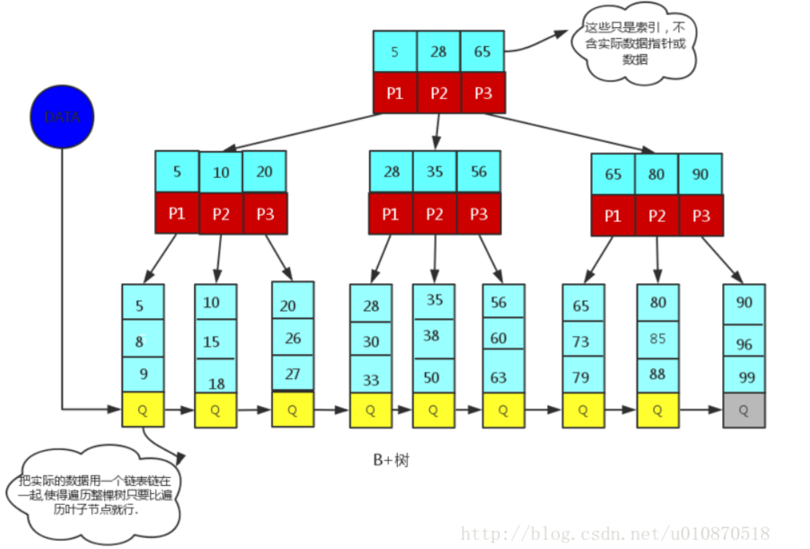

# 为什么MySQL数据库索引选择使用B+树？

<!-- TOC -->
- [二叉查找树](#二叉查找树)
  - [二叉查找树局限性](#二叉查找树局限性)
- [AVL](#AVL)
  - [AVL局限性](#AVL局限性)
- [红黑树](#红黑树)
  - [红黑树应用](#红黑树应用)
- [B树](#B树)
  - [B树的性质](#B树的性质)
- [B+树](#B+树)
  - [为什么说B+树比B树更适合数据库索引？](#为什么说B+树比B树更适合数据库索引？)

<!-- /TOC -->

## 二叉查找树

二叉查找树也称为有序二叉查找树，满足二叉查找树的一般性质，是指一棵空树具有如下性质：

1. 任意节点左子树不为空,则左子树的值均小于根节点的值
2. 任意节点右子树不为空,则右子树的值均大于于根节点的值
3. 任意节点的左右子树也分别是二叉查找树
4. 没有键值相等的节点

### 二叉查找树局限性  

对于极端情况，二叉查找树会退化成一个有n个节点的线性链。因此若想最大性能的构造一个二叉查找树，需要这个二叉树是平衡的（这里的平衡从一个显著的特点可以看出这一棵树的高度比上一个树的高度要大，在相同节点的情况下也就是不平衡），从而引出了一个新的定义-平衡二叉树AVL。

## AVL

AVL树是带有平衡条件的二叉查找树，一般是用平衡因子差值判断是否平衡并通过旋转来实现平衡，左右子树树高不超过1，和红黑树相比，它是严格的平衡二叉树，平衡条件必须满足（所有节点的左右子树高度差不超过1）。不管我们是执行插入还是删除操作，只要不满足上面的条件，就要通过旋转来保持平衡，而旋转是非常耗时的，由此我们可以知道AVL树适合用于插入删除次数比较少，但查找多的情况。

### AVL局限性

由于维护这种高度平衡所付出的代价比从中获得的效率收益还大，故而实际的应用不多，更多的地方是用追求局部而不是非常严格整体平衡的红黑树。当然，如果应用场景中对插入删除不频繁，只是对查找要求较高，那么AVL还是较优于红黑树。

## 红黑树

一种二叉查找树，但在每个节点增加一个存储位表示节点的颜色，可以是red或black。通过对任何一条从根到叶子的路径上各个节点着色的方式的限制，红黑树确保没有一条路径会比其它路径长出两倍。它是一种弱平衡二叉树(由于是弱平衡，可以推出，相同的节点情况下，AVL树的高度低于红黑树)，相对于要求严格的AVL树来说，它的旋转次数变少，所以对于搜索、插入、删除操作多的情况下，我们就用红黑树。

1. 每个节点非红即黑
2. 根节点是黑的
3. 每个叶节点(叶节点即树尾端NULL指针或NULL节点)都是黑的
4. 如果一个节点是红的,那么它的两儿子都是黑的
5. 对于任意节点而言，其到叶子点树NULL指针的每条路径都包含相同数目的黑节点
6. 每条路径都包含相同的黑节点

### 红黑树应用

1. 广泛用于C++的STL中，Map和Set都是用红黑树实现的
2. 著名的Linux进程调度Completely Fair Scheduler，用红黑树管理进程控制块，进程的虚拟内存区域都存储在一颗红黑树上，每个虚拟地址区域都对应红黑树的一个节点，左指针指向相邻的地址虚拟存储区域，右指针指向相邻的高地址虚拟地址空间
3. IO多路复用epoll的实现采用红黑树组织管理sockfd，以支持快速的增删改查
4. Nginx中用红黑树管理timer，因为红黑树是有序的，可以很快的得到距离当前最小的定时器
5. Java中TreeMap的实现

## B树

B/B+树是为了磁盘或其它存储设备而设计的一种平衡多路查找树(相对于二叉，B树每个内节点有多个分支)，与红黑树相比，在相同的的节点的情况下，一颗B/B+树的高度远远小于红黑树的高度(在下面B/B+树的性能分析中会提到)。B/B+树上操作的时间通常由存取磁盘的时间和CPU计算时间这两部分构成，而CPU的速度非常快，所以B树的操作效率取决于访问磁盘的次数，关键字总数相同的情况下B树的高度越小，磁盘I/O所花的时间越少。

### B树的性质

1. 定义任意非叶子结点最多只有M个儿子，且M>2；
2. 根结点的儿子数为[2, M]；
3. 除根结点以外的非叶子结点的儿子数为[M/2, M]；
4. 每个结点存放至少M/2-1（取上整）和至多M-1个关键字；（至少2个关键字）
5. 非叶子结点的关键字个数=指向儿子的指针个数-1；
6. 非叶子结点的关键字：K[1], K[2], …, K[M-1]；且K[i] < K[i+1]；
7. 非叶子结点的指针：P[1], P[2], …, P[M]；其中P[1]指向关键字小于K[1]的子树，P[M]指向关键字大于K[M-1]的子树，其它P[i]指向关键字属于(K[i-1], K[i])的子树；
8. 所有叶子结点位于同一层；

## B+树

B+树是应文件系统所需而产生的一种B树的变形树（文件的目录一级一级索引，只有最底层的叶子节点（文件）保存数据）非叶子节点只保存索引，不保存实际的数据，数据都保存在叶子节点中，这不就是文件系统文件的查找吗?
所有的非叶子节点都可以看成索引部分！

B+树的性质(下面提到的都是和B树不相同的性质)

1. 非叶子节点的子树指针与关键字个数相同
2. 非叶子节点的子树指针p[i],指向关键字值属于[k[i],k[i+1]]的子树.(B树是开区间,也就是说B树不允许关键字重复,B+树允许重复)
3. 为所有叶子节点增加一个**链指针**
4. **所有关键字都在叶子节点出现**(稠密索引)。(且链表中的关键字恰好是有序的)
5. 非叶子节点相当于是叶子节点的索引(稀疏索引)，叶子节点相当于是存储(关键字)数据的数据层
6. 更适合于文件系统

## 为什么说B+树比B树更适合数据库索引？

1、 B+树的磁盘读写代价更低：B+树的内部节点并没有指向关键字具体信息的指针，因此其内部节点相对B树更小，如果把所有同一内部节点的关键字存放在同一盘块中，那么盘块所能容纳的关键字数量也越多，一次性读入内存的需要查找的关键字也就越多，相对IO读写次数就降低了。

2、B+树的查询效率更加稳定：由于非终结点并不是最终指向文件内容的结点，而只是叶子结点中关键字的索引。所以任何关键字的查找必须走一条从根结点到叶子结点的路。所有关键字查询的路径长度相同，导致每一个数据的查询效率相当。

3、由于B+树的数据都存储在叶子结点中，分支结点均为索引，方便扫库，只需要扫一遍叶子结点即可，但是B树因为其分支结点同样存储着数据，我们要找到具体的数据，需要进行一次中序遍历按序来扫，所以B+树更加适合在区间查询的情况，所以通常B+树用于数据库索引。
