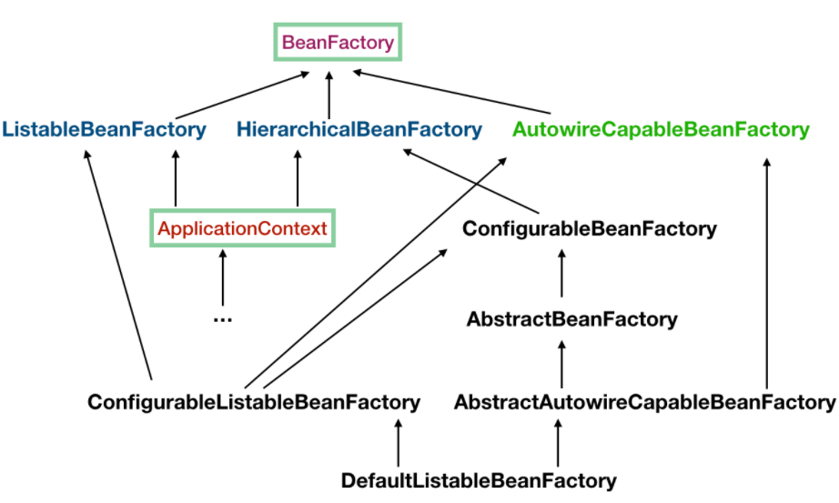

# Spring

## Spring IOC

IOC: 为了解决对象之间的耦合度过高的问题，别名：DI。依赖注入(DI)和控制反转(IOC)是从不同的角度的描述的同一件事情，就是指通过引入IOC容器，利用依赖关系注入的方式，实现对象之间的解耦。  
IOC中最基本的技术就是“反射(Reflection)”编程。

Spring IOC: Spring 通过配置文件描述 Bean 及 Bean 之间的依赖关系，利用 Java 语言的反射功能实例化Bean 并建立 Bean 之间的依赖关系。Spring 的 IoC 容器在完成这些底层工作的基础上，还提供了 Bean 实例缓存、生命周期管理、 Bean 实例代理、事件发布、资源装载等高级服务。

### Spring容器高层视图

Spring 启动时读取应用程序提供的Bean 配置信息，并在Spring 容器中生成一份相应的Bean 配置注册表，然后根据这张注册表实例化Bean，装配好Bean 之间的依赖关系，为上层应用提供准备就绪的运行环境。其中Bean 缓存池为HashMap 实现。


### IoC容器实现


`BeanFactory`是 Spring 框架的基础设施，面向Spring`本身；ApplicationContext`面向使用Spring 框架的开发者，几乎所有的应用场合我们都直接使用`ApplicationContext`而非底层的`BeanFactory`。

#### BeanFactory

* `BeanDefinitionRegistry` 注册表  
Spring 配置文件中每一个节点元素在 Spring 容器里都通过一个`BeanDefinition`对象表示，它描述了 Bean 的配置信息。而`BeanDefinitionRegistry`接口提供了向容器手工注册BeanDefinition 对象的方法。
* `BeanFactory` 顶层接口  
位于类结构树的顶端 ，它最主要的方法就是`getBean(String beanName)`，该方法从容器中返回特定名称的Bean，`BeanFactory`的功能通过其他的接口得到不断扩展：
* `ListableBeanFactory`  
该接口定义了访问容器中Bean基本信息的若干方法，如查看Bean的个数、获取某一类型Bean的配置名、查看容器中是否包括某一Bean等方法
* `HierarchicalBeanFactory` 父子级联  
父子级联IoC容器的接口，子容器可以通过接口方法访问父容器； 通过`HierarchicalBeanFactory`接口， Spring的IoC容器可以建立父子层级关联的容器体系，子容器可以访问父容器中的Bean，但父容器不能访问子容器的Bean。Spring使用父子容器实现了很多功能，比如在 Spring MVC中，展现层Bean位于一个子容器中，而业务层和持久层的Bean位于父容器中。这样，展现层Bean就可以引用业务层和持久层的 Bean，而业务层和持久层的Bean则看不到展现层的Bean。
* `ConfigurableBeanFactory`  
是一个重要的接口，增强了IoC容器的可定制性，它定义了设置类装载器、属性编辑器、容器初始化后置处理器等方法
* `AutowireCapableBeanFactory` 自动装配  
定义了将容器中的Bean按某种规则（如按名字匹配、按类型匹配等）进行自动装配的方法；
* `SingletonBeanRegistry` 运行期间注册单例Bean  
定义了允许在运行期间向容器注册单实例Bean的方法；对于单实例（singleton）的Bean来说，`BeanFactory`会缓存Bean实例，所以第二次使用`getBean()`获取Bean时将直接从IoC容器的缓存中获取Bean实例。Spring在`DefaultSingletonBeanRegistry` 类中提供了一个用于缓存单实例Bean的缓存器，它是一个用`ConcurrentHashMap`实现的缓存器，单实例的Bean以`beanName`为键保存在这个`Map`中。

#### ApplicationContext


* `ClassPathXmlApplicationContext`：默认从类路径加载配置文件
* `FileSystemXmlApplicationContext`：默认从文件系统中装载配置文件
* `ApplicationEventPublisher`：让容器拥有发布应用上下文事件的功能，包括容器启动事件、关闭事件等。
* `MessageSource`：为应用提供i18n国际化消息访问的功能；
* `ResourcePatternResolver`：所有`ApplicationContext`实现类都实现了类似于`PathMatchingResourcePatternResolver`的功能，可以通过带前缀的`Ant`风格的资源文件路径装载`Spring`的配置文件。
* `LifeCycle`：提供了`start()`和`stop()`两个方法，主要用于控制异步处理过程。在具体使用时，该接口同时被`ApplicationContext`的实现及具体Bean来实现，`ApplicationContext`的实现会将`start/stop`的信息传递给容器中所有实现了该接口的Bean，以达到管理和控制JMX、任务调度等目的。
* `ConfigurableApplicationContext`扩展于`ApplicationContext`，它新增加了两个主要的方法：`refresh()`和`close()`，具有启动、刷新和关闭应用上下文的能力。在应用上下文关闭的情况下调用`refresh()`即可启动应用上下文，在已经启动的状态下，调用`refresh()`则清除缓存并重新装载配置信息，而调用`close()`则可关闭应用上下文。

#### 流程

ApplicationContext构造函数最后一步调用refresh(), 源码如下：  

```java
public void refresh() throws BeansException, IllegalStateException {
  synchronized (this.startupShutdownMonitor) {
    // 准备工作，记录下容器的启动时间、标记“已启动”状态、处理配置文件中的占位符
    prepareRefresh();

    // 这步比较关键，这步完成后，配置文件就会解析成一个个 Bean 定义，注册到 BeanFactory 中，
    // 当然，这里说的 Bean 还没有初始化，只是配置信息都提取出来了，
    // 注册也只是将这些信息都保存到了注册中心(说到底核心是一个 beanName-> beanDefinition 的 map)
    ConfigurableListableBeanFactory beanFactory = obtainFreshBeanFactory();
    
    // 设置 BeanFactory 的类加载器，添加几个 BeanPostProcessor
    prepareBeanFactory(beanFactory);
    
    try {
        // 【这里需要知道 BeanFactoryPostProcessor 这个知识点，Bean 如果实现了此接口，
        // 那么在容器初始化以后，Spring 会负责调用里面的 postProcessBeanFactory 方法。】

        // 这里是提供给子类的扩展点，到这里的时候，所有的 Bean 都加载、注册完成了(注解除外)，但是都还没有初始化
        // 具体的子类可以在这步的时候添加一些特殊的BeanFactoryPostProcessor的实现类或做点什么事
        postProcessBeanFactory(beanFactory);

        // 调用 BeanFactoryPostProcessor各个实现类的 postProcessBeanFactory(factory) 方法（注解的bean在这里加载定义到beanfactory）
        invokeBeanFactoryPostProcessors(beanFactory);
        
        // 注册 BeanPostProcessor 的实现类，注意看和 BeanFactoryPostProcessor 的区别
        // 此接口两个方法: postProcessBeforeInitialization 和 postProcessAfterInitialization
        // 两个方法分别在 Bean 初始化之前和初始化之后得到执行。注意，到这里 Bean 还没初始化
        registerBeanPostProcessors(beanFactory); 

        initMessageSource(); // 初始化MessageSource

        initApplicationEventMulticaster(); // 初始化Application事件广播器

        // 从方法名就可以知道，典型的模板方法(钩子方法)，
        // 具体的子类可以在这里初始化一些特殊的 Bean（在初始化 singleton beans 之前）
        onRefresh();

        // 注册事件监听器，监听器需要实现 ApplicationListener 接口
        registerListeners();
        
        // 重点，重点，重点
        // 初始化所有的 singleton beans
        //（lazy-init 的除外）
        finishBeanFactoryInitialization(beanFactory); // 实例化所有剩余的非懒加载的singleton的bean

        // 最后，广播事件，ApplicationContext 初始化完成
        finishRefresh(); 
    }
    //...
}
```

## AOP

AOP思想的实现一般都是基于**代理模式** ，在JAVA中一般采用JDK动态代理模式，但是我们都知道，JDK动态代理模式只能代理接口而不能代理类。因此，Spring AOP会这样子来进行切换，因为Spring AOP同时支持CGLIB、ASPECTJ、JDK动态代理。

* 如果目标对象的实现类实现了接口，Spring AOP将会采用JDK动态代理来生成AOP代理类；
* 如果目标对象的实现类没有实现接口，Spring AOP将会采用CGLIB来生成AOP代理类——不过这个选择过程对开发者完全透明、开发者也无需关心。

代理+反射

### AOP应用场景

权限控制、缓存控制、事务控制、审计日志、性能监控、分布式追踪、异常处理

### AspectJ

5种Advice注解

1. @Before 前置通知
2. @After（finally)，后置通知，方法执行完之后
3. @AfterReturning，返回通知，成功执行之后
4. @AfterThrowing，异常通知，抛出异常之后
5. @Around，环绕通知

### JDK动态代理

类：java.lang.reflect.Proxy  
接口：InvocationHandler  
只能基于接口进行动态代理

```java
public class JdkInvocationHandler implements InvocationHandler {

  private final RealSubject realSubject;

  public JdkInvocationHandler(RealSubject realSubject) {
    this.realSubject = realSubject;
  }

  @Override
  public Object invoke(Object proxy, Method method, Object[] args) throws Throwable {
    System.out.println("before");
    Object result = null;
    try {
      result = method.invoke(realSubject, args);
    } catch (Exception ex) {
      System.out.println("exception: " + ex.getMessage());
      throw ex;
    } finally {
      System.out.println("after");
    }
    return result;
  }

  public static void main(String[] args) {
    Subject subject = (Subject) Proxy
        .newProxyInstance(JdkInvocationHandler.class.getClassLoader(), new Class[]{Subject.class}, new JdkInvocationHandler(new RealSubject()));
    subject.methodA();
    subject.methodB();
  }
}
```

### CGLib代理

```java
public class CglibMethodInterceptor implements MethodInterceptor {

  @Override
  public Object intercept(Object o, Method method, Object[] objects, MethodProxy methodProxy)
      throws Throwable {
    System.out.println("before");
    Object result = null;
    try {
      result = methodProxy.invokeSuper(o, objects);
    } catch (Exception ex) {
      System.out.println("ex: " + ex.getMessage());
      throw ex;
    } finally {
      System.out.println("after");
    }
    return result;
  }

  public static void main(String[] args) {
    Enhancer enhancer = new Enhancer();
    enhancer.setSuperclass(RealSubject.class);
    enhancer.setCallback(new CglibMethodInterceptor());
    Subject subject = (Subject) enhancer.create();
    subject.methodA();
    subject.methodB();
  }
}
```

### JDK与Cglib代理对比

* JDK只能针对有接口的类的接口方法进行动态代理
* Cglib基于继承来实现代理，无法对static，final类进行代理
* Cglib基于继承来实现代理，无法对static，private方法进行代理

### Spring AOP

Spring 只是使用了与 AspectJ 5 一样的注解，但仍然没有使用 AspectJ 的编译器，底层依是动态代理技术的实现，因此并不依赖于 AspectJ 的编译器。

* 如果目标对象实现了接口，则默认使用JDK动态代理
* 如果目标对象没有实现接口，则采用Cglib动态代理
* 如果目标对象实现了接口，且强制Cglib代理（`@EnableAspectJAutoProxy(proxyTargetClass=true)`），则使用Cglib代理。
代理模式

#### Spring AoP链式调用

责任链模式
