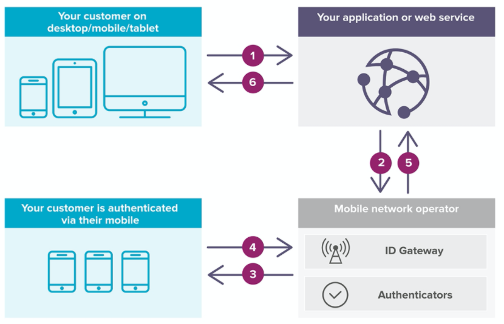

# Mobile Connect

## Summary

移动连接是一个安全的通用登录解决方案，它匹配用户到他们的移动设备，并允许他们安全地登录到应用程序和网站，而不需要记住用户名和密码。它采用OpenID连接标准作为框架，通过扩展一定的参数来保证移动连接的安全性。

## 流程

1. 终端用户单击移动连接按钮访问服务
2. 应用程序使用OpenID和Mobile Connect配置文件向最终用户的运营商发出身份验证请求
3. 运营商向用户发送认证请求
4. 用户使用移动设备对自己进行身份验证
5. 运营商给应用程序返回指定特定最终用户的PCR
6. 用户可以访问应用程序

## PCR（Pseudonymous Customer Reference，匿名用户引用）

用于指代特定终端用户帐户和特定应用程序/web服务之间的配对的唯一标识符。  
PCR由运营商的身份网关(ID Gateway)在终端用户身份验证成功之后生成，并包含在Open ID Connect响应中返回的ID Token中。尽管PCR是由一个特定的ID Gateway生成的，但Mobile Connect声明它必须是全球唯一的，因此建议它是一个静态值。这样，对于特定的终端用户和应用程序/web服务组合，即使用户切换运营商，给定用户的PCR也会保持不变。这意味着操作符的改变对应用程序/web服务使用的PCR没有影响。
>为什么要使用PCR呢?
通过使用PCR，不需要为访问应用程序/web服务提供关于用户的个人数据。服务提供者(应用程序/web服务)被保证实际用户已经使用Mobile Connect进行了身份验证，然后应用程序可以请求有关用户的额外信息。这允许用户确信他们的个人信息只有在他们明确同意的情况下才会与他们选择的应用程序共享。  
应用程序/web服务将针对用户帐户的PCR存储在数据库中。

PCR是一项重要的信息，应该始终保密。

PCR会放在ID token的sub字段

## KYC(Know Your Customer)

KYC Match为服务提供商SP提供了一种机制，让他们从运营商那里接收与用户移动设备账户相关的关键参数的反馈，以防止它被用作服务提供商账户接管攻击（同一个手机号，给了其他用户）的一部分。这种机制基于将服务提供者持有的数据与运营商持有的数据进行比较。实际的数据比较将是具体实现的，但底层机制没有改变。
