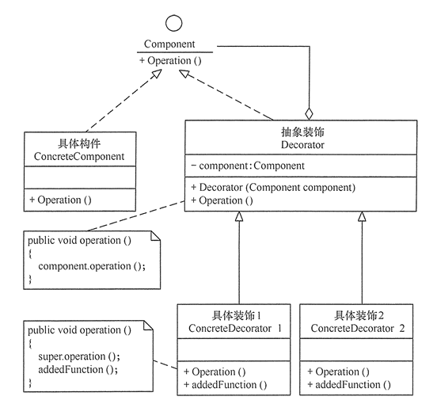

# 装饰器模式

指在**不改变现有对象结构**的情况下，动态地给该对象增加一些职责（即增加其额外功能）的模式

## 优缺点

装饰器模式的主要优点有：
* 装饰器是继承的有力补充，比继承灵活，在不改变原有对象的情况下，动态的给一个对象扩展功能，即插即用
* 通过使用不用装饰类及这些装饰类的排列组合，可以实现不同效果
* 装饰器模式完全遵守开闭原则

其主要缺点是：装饰器模式会增加许多子类，过度使用会增加程序得复杂性。

## 结构

装饰器模式主要包含以下角色。
* 抽象构件（Component）角色：定义一个抽象接口以规范准备接收附加责任的对象。
* 具体构件（ConcreteComponent）角色：实现抽象构件，通过装饰角色为其添加一些职责。
* 抽象装饰（Decorator）角色：继承抽象构件，并包含具体构件的实例，可以通过其子类扩展具体构件的功能。
* 具体装饰（ConcreteDecorator）角色：实现抽象装饰的相关方法，并给具体构件对象添加附加的责任。

