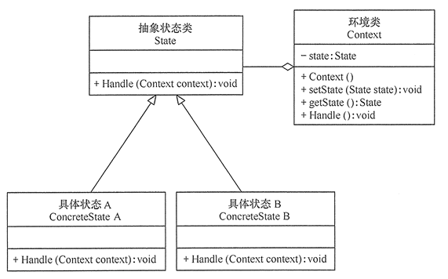

# 状态模式

对有状态的对象，把复杂的“判断逻辑”提取到不同的状态对象中，允许状态对象在其内部状态发生改变时改变其行为。

## 优缺点

状态模式是一种对象行为型模式，其主要优点如下。
* 结构清晰，状态模式将与特定状态相关的行为局部化到一个状态中，并且将不同状态的行为分割开来，满足“单一职责原则”。
* 将状态转换显示化，减少对象间的相互依赖。将不同的状态引入独立的对象中会使得状态转换变得更加明确，且减少对象间的相互依赖。
* 状态类职责明确，有利于程序的扩展。通过定义新的子类很容易地增加新的状态和转换。

状态模式的主要缺点如下。
* 状态模式的使用必然会增加系统的类与对象的个数。
* 状态模式的结构与实现都较为复杂，如果使用不当会导致程序结构和代码的混乱。
* 状态模式对开闭原则的支持并不太好，对于可以切换状态的状态模式，增加新的状态类需要修改那些负责状态转换的源码，否则无法切换到新增状态，而且修改某个状态类的行为也需要修改对应类的源码。

## 结构

状态模式包含以下主要角色。
* 环境类（Context）角色：也称为上下文，它定义了客户端需要的接口，内部维护一个当前状态，并负责具体状态的切换。
* 抽象状态（State）角色：定义一个接口，用以封装环境对象中的特定状态所对应的行为，可以有一个或多个行为。
* 具体状态（Concrete State）角色：实现抽象状态所对应的行为，并且在需要的情况下进行状态切换。

