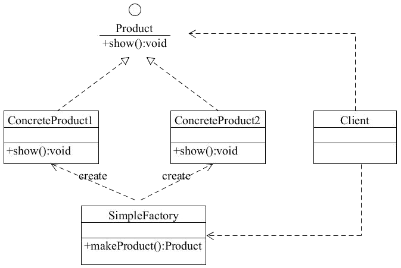
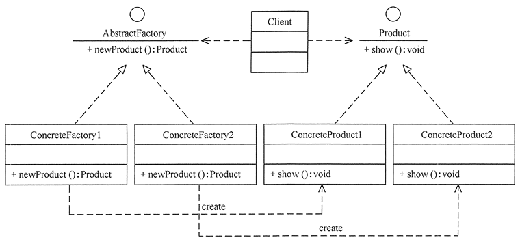
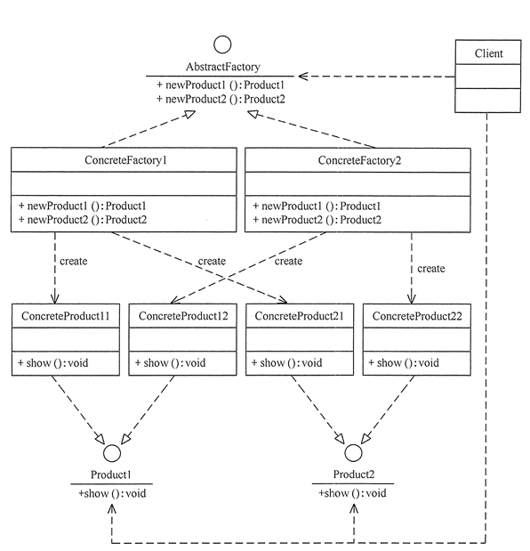

# 工厂模式

## 简单工厂模式

又可写成静态工厂模式，工厂类根据传入的参数生产不一样的产品  
弊端： 增加了产品类型，需要修改原有的工厂代码

### 简单工厂模式结构

* 简单工厂（SimpleFactory）：是简单工厂模式的核心，负责实现创建所有实例的内部逻辑。工厂类的创建产品类的方法可以被外界直接调用，创建所需的产品对象。
* 抽象产品（Product）：是简单工厂创建的所有对象的父类，负责描述所有实例共有的公共接口。
* 具体产品（ConcreteProduct）：是简单工厂模式的创建目标。

## 工厂方法模式

抽象出一个工厂接口，把之前的一个工厂类拆成多个工厂类，每个类对应一个产品。这样如果增加产品类型的话，只要添加具体产品实现和工厂实现，可以不改变已有代码。
弊端：一个工厂只能生产一种产品，子类太多

### 工厂方法模式结构

* 抽象工厂（Abstract Factory）：提供了创建产品的接口，调用者通过它访问具体工厂的工厂方法 newProduct() 来创建产品。
* 具体工厂（ConcreteFactory）：主要是实现抽象工厂中的抽象方法，完成具体产品的创建。
* 抽象产品（Product）：定义了产品的规范，描述了产品的主要特性和功能。
* 具体产品（ConcreteProduct）：实现了抽象产品角色所定义的接口，由具体工厂来创建，它同具体工厂之间一一对应。

## 抽象工厂模式

给产品分类，这样一个工厂可以负责几个产品的生产。

### 抽象工厂模式结构

* 抽象工厂（Abstract Factory）：提供了创建产品的接口，它包含多个创建产品的方法 newProduct()，可以创建多个不同等级的产品。
* 具体工厂（Concrete Factory）：主要是实现抽象工厂中的多个抽象方法，完成具体产品的创建。
* 抽象产品（Product）：定义了产品的规范，描述了产品的主要特性和功能，抽象工厂模式有多个抽象产品。
* 具体产品（ConcreteProduct）：实现了抽象产品角色所定义的接口，由具体工厂来创建，它同具体工厂之间是多对一的关系。

