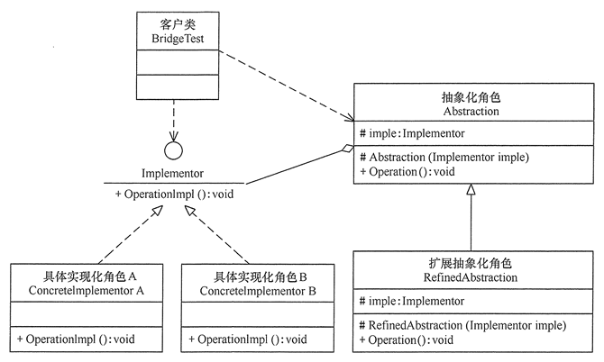

# 桥接模式

将**抽象与实现分离**，使它们可以独立变化。它是用**组合**关系代替继承关系来实现，从而降低了抽象和实现这两个可变维度的耦合度。

jasmine：容易变的抽成抽象类，如果有好几个维度的抽象类，减少各种组合的子类。

## 优缺点

桥接（Bridge）模式的优点是：
* 抽象与实现分离，扩展能力强
* 符合开闭原则
* 符合合成复用原则
* 其实现细节对客户透明

缺点是：由于聚合关系建立在抽象层，要求开发者针对抽象化进行设计与编程，能正确地识别出系统中两个独立变化的维度，这增加了系统的理解与设计难度。

## 结构

* 抽象化（Abstraction）角色：定义抽象类，并包含一个对实现化对象的引用。
* 扩展抽象化（Refined Abstraction）角色：是抽象化角色的子类，实现父类中的业务方法，并通过组合关系调用实现化角色中的业务方法。
* 实现化（Implementor）角色：定义实现化角色的接口，供扩展抽象化角色调用。
* 具体实现化（Concrete Implementor）角色：给出实现化角色接口的具体实现。

## 桥接模式和适配器模式的区别

### 共同点

桥接和适配器都是让两个东西配合工作

### 不同点

出发点不同：

* 适配器：已有的接口，通过适配器让他们相容。
* 桥接模式：分离抽象化和实现，使两者的接口可以不同，目的是分离。

